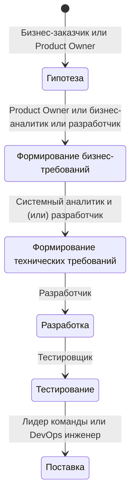

# Команда и процессы

Статья рассказывает о структуре команд для выполнения IT-проектов и производственных процессах. На

# Типы компаний по размеру

Чем больше компания, тем больше в ней IT специалистом и тем лучше выстроены процессы.

## Маленькая компания

**Маленькая компания** - это стартап и компания, специализирующаяся на разработке одного продукта.  

1. В маленькой компании как правило одна команда разработки
2. Члены команды часто совмещают несколько ролей, так как денег не очень много: Разработчик + Аналитик, Разработчик + Тестировщик.
3. Часто владелец компании принимает участие в процессах разработки. 
4. Требования и приоритеты могут быстро меняться, что может приводить к отсутствию структурированных процессов разработки.

## Средняя компания

**Средняя компания** - это компания, которая разрабатывает несколько продуктов (Меньше 10).

1. Средняя компания может позволить себе содержать больше одной команды разрабоки.
2. Производственный процесс в такой компании более структурирован и стабилен. 
3. В иерархии сотрудников появляется несколько уровней.

## Крупная компания

**Крупная компания** - это компания, которая разрабатывает множество продуктов (Больше 10). 

1. В крупной компании множество команд разрабоки.
2. Производственный процесс выстроен и работает эффективно. Используются гибкие подходы разработки и фреймворки: Kanban, Scrum.
3. В иерархии сотрудников появляется много уровней: от разработчика до CTO их может быть 3 и более.

# Типы компаний по деятельности

## Продуктовая компания

Продуктовая компания получает основную прибыль с продуктов, которые разрабатывает. Например, Яндекс - это крупная продуктовая компания.  

В продуктовой компании ты с большой вероятностью будешь работать над одним продуктом долгое время. Особенно, если компания маленькая.  

### Плюсы 

- **Погружение в продукт** — ты детально изучаешь один продукт, понимаешь бизнес-процессы и видишь результаты своей работы
- **Стабильность** — обычно более предсказуемый график и долгосрочная занятость
- **Менторство** — часто есть структурированное обучение и возможность работать с опытными коллегами
- **Карьерный рост** — понятная карьерная лестница внутри компании
Командная работа — более тесное взаимодействие с коллегами из разных отделов

### Минусы 

- **Ограниченный технологический стек** — работа преимущественно с технологиями, используемыми в конкретном продукте
- **Меньшая гибкость** — часто более строгие корпоративные правила и процессы
- **Медленный темп изменений** — в продуктовых компаниях внедрение новых технологий может происходить медленнее

## Аутстаф

Аутстафф зарабатывает на перепродаже разработчиков другим компаниям. Например, тебя нанимают на позицию middle за 250k, а продают как senior за 400k. Разницу оставляют себе. При этом ты работаешь как член команды заказчика.

### Плюсы

- **Часто не высокие требования к hard-скиллам** - аутстаф сам накрутит тебе опыт, если нужно. Их задача продать тебя как можно дороже. 
- **Разнообразный опыт** — работа в команде клиента, но с возможностью смены проектов
- Сочетание стабильности и разнообразия — официальное трудоустройство в аутстафф-компании, но работа на стороне клиента
- **Меньше бюрократии** — часто более гибкие условия работы
- **Нетворкинг** — возможность установить контакты в разных компаниях

### Минусы

- **Ниже уровень оплаты** - Часто ты можешь получить больше денег при самостоятельном устройстве.
- **Раздвоенность подчинения** — необходимость отчитываться и перед аутстафф-компанией, и перед клиентом
- **Меньшая интеграция** — не всегда полное погружение в команду клиента
- **Переменчивость проектов** — возможны периоды между проектами или неожиданные смены заданий
- **Ограничения по работе в компаниях-партнерах аутстаффа**. Например, ты не сможешь уволиться и устроиться в компанию, в которую был продан в течении полугода. Есть не везде

## Аутсорс

Аутсорс зарабатывает на разработке проектов на заказ. 

### Плюсы

- **Максимальное разнообразие проектов** — работа над разными задачами для разных клиентов
- **Широкий технологический стек** — возможность освоить множество технологий
- **Быстрый профессиональный рост** — интенсивное обучение в условиях постоянной смены задач
- **Гибкость** — часто более свободный график и возможность удаленной работы

### Минусы

- **Нестабильность** — возможны периоды без проектов или с высокой нагрузкой
- **Меньше глубины** — часто нет возможности глубоко погрузиться в бизнес-логику проектов
- **Сжатые сроки** — обычно более строгие дедлайны и высокий темп работы с низким качеством решений
- **Меньше структурированного обучения** — часто приходится осваивать новые технологии самостоятельно

# Команда

Для реализации проекта нужна команда. Рассмотрим основные роли в команде и рекомендуемый состав команды на примере кросс-функциональной команды.

## Роли

Рассмотрим основные роли в команде:
- **Владелец продукта (Product Owner или PO)** - Формирует требования бизнеса
- **Аналитик** - Разрабатывает требования. Аналитики бывают двух типов: бизнес и системные. Бизнес-аналитик разрабатывает бизнес-требования на основе гипотезы. Системный аналитик преобразовывает результат работы бизнес-аналитика в технические требования, понятные разработчику. На проекте может быть и бизнес и системный аналитик, или один аналитик совмешающий эти роли; а может не быть аналитика вообще, тогда проработкой требований могут занимать разработчики или архитекторы.
- **Лидер команды (Team Lead)** - Организует команду. Он может иметь технические компетенции - быть разработчиком в прошлом и на момент лидерства. Часто принимает на себя дополнительную роль **Фасилитатор**.
- **Архитектор решения (Solution Architect)** - Проектирует и принимает решения об верхнеуровневой архитектуре рещения и взаимодействиях с системами вне зоны ответсвенности команды. Роль архитектора может исполнять разработчик.
- **Web разработчик** - Разрабатывает web-приложение или его часть в зоне ответсвенности проекта.
- **Android разработчик** - Разрабатывает android-приложение или его часть в зоне ответсвенности проекта.
- **IOS разработчик** - Разрабатывает ios-приложение или его часть в зоне ответсвенности проекта.
- **Backend разработчик** - Разрабатывает backend или его часть в зоне ответсвенности проекта.
- **Тестировщик (QA)** - Проводит тестирование разработанной функциональности: функциональное и регрессионное. У тестировщиков бывают разные специальности. Оставнови свой выбор на ручном тестировщике, как правило они есть в каждой команде.
- **DevOps инженер** - Занимается настройкой CI/CD, иногда инфраструктуры. Может быть приходящим или закреплен за командой. Если его нет, то роль может брать на себя разработчик.
- **Scrum Master/Delivery Manager/Фасилитатор** - Человек, который следит за выполнением производственного процесса в команде. Организует командные мероприятия. Эту роль может брать на себя любой член команды, поэтому отдельного человека может не быть.

**Обязательные роли:** Backend разработчик, один Frontend разработчик (Web или Android или IOS), Product Owner, Тестировщик.  
При этом роли аналитика, архитектора и фасилитатора могут брать на себя другие члены команды.

## Рекомендуемый состав команды

Рекомендуется не раздувать состав команды, но при этом включать минимум 2 роли, аналогичными твоей. Если ты backend-разработчик, включай минимум двух backend-разработчиков: это может быть тимлид с опытом разработки или второй разработчик. Так ты сможешь использовать дополнительного разработчика в описании процессов. Например, при рассказе о том, как был устроен процесс code-review.

Включи в команду основные роли, остальные добавь при необходимости. Рекомендуемый состав команды:
```
Наша команда состояла из 7 человек:

- Product Owner
- Team Lead
- 1 аналитик
- 2 backend-разработчика (включая меня)
- 1 frontend-разработчик
- 1 QA-инженер
```

Если компания маленькая, можешь исключить аналитика или тестировщика, и сказать, что эти функции выполняли разработчики, но тогда тебе придется детальнее рассказать о процессе работы с требованиями или тестировании.

# Процессы

## Процесс производства

Процесс может меняться от компании к компании, но верхнеуровнево его описать так:


Ты должен уметь рассказать о каждом шаге кроме гипотезы.  

### Бизнес -> Гипотеза

Бизнес-заказчик или Product Owner выдвигают гипотезу о том, что новая функциональность принесет пользу бизнесу. Product Owner формирует верхнеуровневые требования.

### Гипотеза -> Формирование бизнес-требований

Product Owner или бизнес-аналитик формирует подробные функциональные и нефункциональные требования для реализации гипотезы. 

### Формирование бизнес-требований -> Формирование технических требований

Системный аналитик или разработчик формирует подробные технические требования, понятные разработчику, чтобы он мог реализовать её.

### Формирование технических требований -> Разработка

Когда технические требования сформированы, задача оценена и запланирована разработчик может взять задачу в работу.

### Разработка -> Тестирование

Когда разработка завершена, задача передается в тестирование тестировщику.  
В случае возникновения багов, тестировщик возвращает задачу на доработку разработчику, который исправляет их.

### Тестирование -> поставка

После того, как задача протестирована, она готова к установке на прод. Обычно поставку выполняет DevOps-инженер или лидер команды, но это может делать и разработчик (обычно в маленьких компаниях).  
Когда релиз согласован Product Ownerom и другими заинтересованными лицами, выполняется установка на production.

Обычно существуют окна для релиза: выбирается временной интервал в сутках, когда количество активных пользователей минимально. Это может быть вечер или ночь. Это делается для того, чтобы в случае возникновения проблем на production оказать минимальное влияние на пользователей.

**ВАЖНО:** Практически никогда не бывает релизов в пятницу, так как в субботу некому будет подключиться для исправления проблем.  

### Пример

```
Наш процесс разработки выглядел следующим образом:
1. Product Owner формировал требования на разработку новой функциональности
2. Аналитик анализировал требования и формализовывал их для того, чтобы они стали понятны разработчику, - формировал техническое задание (ТЗ)
3. Разработчик подключался к ревью ТЗ на финальных этапах и вносил корректировки.
4. После того, как ТЗ было готово, задача была готова к планированию.
5. Перед началом спринта проводили планирование, где обсуждали и оценивали задачи из бэклога продукта.
6. Отбирали в спринт задачи из бэклога согласно приоритетам от Product Owner. При этом 20% времени закладывали на сопровождение ошибок с прода. 
7. Ежедневно проводили дейли, где каждый член команды рассказывал о прогрессе, планах и возможных препятствиях.
8. Разработка велась с использованием Git Flow. Для каждой задачи создавалась отдельная ветка. После завершения работы создавался pull request, который проходил код-ревью минимум одним другим разработчиком.
9. Тестирование проводилось на нескольких уровнях:
    - Разработчики писали unit-тесты
    - QA-инженер проводил ручное и автоматизированное тестирование после того, как код с задачей был влита в ветку develop
    - Перед релизом проводилось регрессионное тестирование
10. В конце каждого спринта проводили демонстрацию результатов работы заинтересованным лицам.
11. Также проводили ретроспективу, где обсуждали, что можно улучшить в нашем процессе.
12. Релизы проводились после каждого спринта.

У нас был настроен CI/CD девопс инженером, который не входил в команду. Была отдельная команда devops, которая выполняла задачи по заявкам в jira в DevOps пространство.
На стадии MR у нас выполнялась проверка, что все тесты прошли, а также вычислялся подсчет покрытия.
```

## Методологии

Средние и крупные компании используют методологии и фреймворки для работы: Agile + SCRUM или Kanban.  
Встретить процесс, который будет полностью следовать фреймворку практически невозможно, потому что процессы меняются в зависимости от специфики компании. 

### Agile

**Agile** — это набор процессов разработки, а не единственный подход в разработке программного обеспечения, и определяется Agile Manifesto. Agile не включает практики, а определяет ценности и принципы, которыми руководствуются команды.

**Основные идеи:**
- Люди и взаимодействие важнее процессов и инструментов
- Работающий продукт важнее исчерпывающей документации
- Сотрудничество с заказчиком важнее согласования условий контракта
- Готовность к изменениям важнее следования первоначальному плану

Как правило, Agile подразумевает работу итерациями, которые называют спринтами. **Спринт** - это короткий временной интервал, в течение которого команда выполняет заданный объем работы. Спринт нацелен на реализацию конкретной функциональности и имеет четкую цуль. Обычно спринт включает в себя все этапы необходимые для достижения цели: планирование, анализ требований, проектирование, разработку, тестирование. Как правило спринт длится 2 недели.  
В идеальном мире подразумевается, что за спринт реализуется функциональность, которая готова к поставке пользователю. В реальном мире зачастую, это не так: реализация может занимать два и более спринтов.

### Kanban

**Канбан** — это метод управления разработкой, реализующий принцип «точно в срок» и способствующий равномерному распределению нагрузки между работниками. При данном подходе весь процесс разработки прозрачен для всех членов команды. Задачи по мере поступления заносятся в единую доску, откуда каждый разработчик может взять в работу требуемую задачу.

### Scrum

**SCRUM** - это фреймворк, который позволяет четко структурировать процессы разработки. SCRUM использует спринты.

Верхнеуровнево рассмотрим основные этапы цикла производства в SCRUM:
- **Планирование** - Работа с продуктовым бэклогом и отбор задач к реализации в спринт. Планирование спринта выполняется в предыдущего спринта.
- **Daily Scrum** - Ежедневные мероприятия, поддерживающие процесс, и работа с бэклогом спринта. Как правило, это **Daily** - 15 минутные встречи, на которых каждый член команды рассказывает, чем занимался вчера, чем будет заниматься сегодня и о проблемах. 
- **Ревью спринта** - Передача разработанной функциональности заказчикам для проверки. В случае успешной проверки, задачи считаются закрытыми.
- **Ретроспектива** - Анализ итогов спринта. Обсуждается была ли достигнута цель спринта, какие проблемы возникли и как их можно предотвратить.

Этих знаний должно хватить для интервью. Если нужны подробности, изучи их самостоятельно.

## Работа с git

Наиболее популярными подходами к работе с git являются gitflow, gitlabflow и TBD (Trunk Based Development). Часто встречается произвольный подход, когда за основу берется один из перечисленных и дорабатывается, исходя из специфики работы в компании.

### Gitflow

Наиболее популярный подход. Рекомендуется использовать его.

В gitflow существуют стабильные ветки: 
- **develop (разработка)** - Ветка разработки
- **master (прод)** - Ветка с продакшн кодом
А также временные ветки:
- **feature** - ветка с разработкой новой функциональности. Создается только от develop.
- **release** - релизная ветка, содержащая изменения, планируемые к установке в прод. Создается только от develop.
- **hotfix** - ветка с исправлением изменений. Может создаваться от release или master.

Для использования flow рекомендуется иметь 3 среды разработки:
- **develop** - среда разработки, где разработчик может провести функциональное тестирование своей разработки
- **staging** - среда тестирования, где тестировщик выполняет регрессионное тестирование release-ветки
- **production** - прод среда, где реальные пользователи пользуются продуктом.

В маленьких компаниях может не быть staging среды и тестирование проводится на машине разработчика или тестировщика.  
В крупных компаниях могут появляться среда нагрузочного тестирования и preprod среда, максимально приближенная по составу компонентов к prod, для выполнения smoke-тестирования и проверки hotfix-веток от master.  

Чтобы выполнить разработку новой функциональности, разработчик создает feature-ветку от develop и ведет в ней разработку.  
Когда разработка завершена и пройдено ревью, feature-ветка вливается в develop.  
Когда задачи необходимые для релиза влиты в develop, от develop создается release-ветка.  
Тестировщики выполняют тестирование release-ветки.  
Если в ходе тестирования выявлены проблемы, разработчик создает hotfix-ветку от release-ветки (хотфикс тестирования) и выполняет в ней исправления, после чего вливает ее в release-ветку.
Когда все проблемы исправлены и релиз готов к установке, release-ветка вливается в master и в develop (чтобы донести исправления, которые были выполнены в hotfix-ветках). По истечении времени release-ветка удаляется. 

В случае возникновения проблемы на master, процесс аналогичен hotfix на релизной ветке, но в качестве основной выступает master: разработчик создает hotfix-ветку от master; тестировщик выполняет ее тестирование на stage стенде (или preprod, если он есть); hotfix-ветка вливается в master и develop.

Описание с картинками можно посмотреть [здесь](https://danielkummer.github.io/git-flow-cheatsheet/index.ru_RU.html). **ВАЖНО:** git flow не является инструментом из коробки, ресурс приведен только для визуального ознакомления.

### Gitlabflow

Основным отличием является использование в gitlabflow environment-веток. Это означает, что для каждой среды существует долгоживущая ветка. Подробнее с gitlabflow можно познакомиться [здесь](https://docs.gitlab.co.jp/ee/topics/gitlab_flow.html).

### TBD 

TBD встречается редко, поэтому по желанию ознакомься с основной концепцией [здесь](https://trunkbaseddevelopment.com).

## Используемые инструменты

### Ведение задач

- **Jira** 
- **YouTrack**
- **Trello**
- **Яндекс Трекер**
- **Week**

### Хранение документации 

- **Confluence**
- **Notion**

### Хранение кода

- **Gitlab**
- **Github**
- **Bitbucket**

### Созвоны

- **Zoom**
- **Google Meet**
- **Yandex Телемост**

### Чаты

- **Mattermost**
- **Telegram**
- **Yandex Мессенджер**