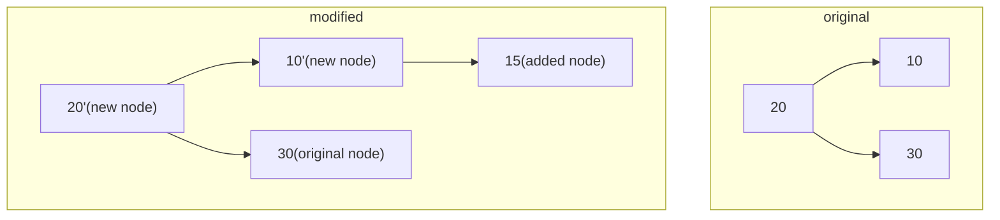

## 📔Ссылочные и значимые типы данных

### 📑В чем разница между ссылочными и значимыми типами данных?

|                                | значимый                                                                           | ссылочный                                                                              |
| ------------------------------ | ---------------------------------------------------------------------------------- | -------------------------------------------------------------------------------------- |
| переменная типа                | хранит непосредственно само значение                                               | ссылку на область памяти, где располагается объект                                     |
| наследуется                    | `System.ValueType`                                                                 | прямо или косвенно от `System.Object`                                                  |
| поддерживает `boxing/unboxing` | да                                                                                 | нет, т.к. уже ссылочный тип (по сути, ссылочный тип всегда находится  в `boxed` форме) |
| размещается в                  | **в стеке**, кроме случаев когда является частью `class` или находится в коллекции | **всегда в куче**                                                                      |
 [[Когда нужно перегружать Equals и GetHashCode]]
### 📑Чем отличается класс от структуры?

| Характеристика                                                                               | Struct                                                                            | Class                  |
| -------------------------------------------------------------------------------------------- | --------------------------------------------------------------------------------- | ---------------------- |
| Тип объекта                                                                                  | значимый                                                                          | ссылочный              |
| Наличие конструктора без параметров                                                          | явно реализовать нельзя,<br>но под капотом он уже есть, поэтому его можно вызвать | есть                   |
| Можно инициализировать поля/свойства напрямую<br>(напр., *public int Numb {get; set; } = 1*) | **нет**                                                                           | да                     |
| Умеет в наследование                                                                         | **нет**                                                                           | да                     |
| Может реализовывать интерфейс                                                                | да                                                                                | да                     |
| Есть финализатор                                                                             | **нет**                                                                           | да                     |
| Как работает Equals()                                                                        | сравниваются значения                                                             | сравниваются ссылки    |
| Передача в метод                                                                             | копия значения (если только в методе входной параметр не указан как `ref/in`)     | копия ссылки на объект |
| Является неизменяемым (**immutable**)                                                        | **да**, только если нет `mutable` полей                                           | нет                    |

### 📑Как долго живут ссылочные типы данных?

До тех пор, пока на объект есть хотя бы одна ссылка. Как только на объект перестает ссылаться код, будет удален при следующей сборке мусора (мгновенно удаление не происходит, GC выбирает что и когда удалить)

### 📑Как долго живут значимые типы данных?

Зависит от того, в какой области памяти они размещены.
	- если экземпляр значимого типа лежит в стеке, то он удаляется при выходе из метода
	- если экземпляр значимого типа является вложенным в другой тип, например, класс  или структуру, то он перестает существовать, когда перестает существовать класс или структура 

### 📑Всегда ли значимые типы данных располагаются в стеке?

Нет, значимый тип хранится в куче в следующих случаях:
	- если он прошел через операцию `boxing`
	- когда значимый тип является членом ссылочного типа

## 📔Компиляция и выполнение

### 📑Что такое CLR и какие функции выполняет?

**C**ommon **L**anguage **R**untime - общеязыковая среда выполнения - среда, в которой происходит исполнения кода. По сути, это виртуальная машина для интерпретации `CIL`-кода в машинные команды. Функции:
- управление памятью
- компиляция `CIL` в машинный код при помощи [[JIT]]
- обработка исключений
- загрузка сборок
- безопасность (например, контроль доступа к типам и методам)
- типизация (например, чтобы переменной типа `int` не было присвоено значение типа `string`)

### 📑Что такое управляемый код?

— код, для выполнения которого нужна `CLR`. Такой код подпадает под действие `GC`, а также разработчику не нужно заботиться о безопасности типов и управлении ресурсами

читай также [[Обучение/Программирование/Теория/C＃/Неуправляемый код|неуправляемый код]]
### 📑В чем разница между релизной и отладочной сборкой?

Основное отличие в **оптимизации кода.** Данные виды сборок предоставляются `MS Visual Studio` из коробки.

|                      | Debug                                                        | Release                                                                                                                                                             |
| -------------------- | ------------------------------------------------------------ | ------------------------------------------------------------------------------------------------------------------------------------------------------------------- |
| оптимизация кода     | **нет**, чтобы код можно было легко отлаживать               | агрессивная оптимизация (напр., удаление неиспользуемого кода, [[Обучение/Менторство/OLD Карточки/Глоссарий#^8aa548\|инлайнинг методов]], оптимизация циклов и ветвлений) |
| отладочная инфа есть | да (генерируются `.pdb` файлы, поэтому код можно отлаживать) | **нет**                                                                                                                                                             |
| точки останова есть  | да                                                           | **нет**                                                                                                                                                             |
| производительность   | невысокая, приходится много с собой таскать                  | высокая, так нет лишней информации                                                                                                                                  |
| когда использовать   | разработка и отладка исходного кода, написание тестов        | продакш и когда важна производительность                                                                                                                            |
>Стоит отметить, что код в `Debug` и в `Release` сборках может вести себя по-разному из-за оптимизации. Если проект уже в продакшене и нужно найти ошибки, то можно создать `.pdb` файлы и использовать [[Обучение/Менторство/OLD Карточки/Глоссарий#^732eec|Symbol Server]] для отладки

%%
разница может быть просто в названии — все зависит от настроек компилятора, которыми эти типы и являются.  
По умолчанию в дебаге отключен оптимизатор, определен флаг DEBUG и генерируются символы отладки.  
Но никто не запрещает в свойствах проекта отключить эти опции и в результате получится тот же Release, но с именем Debug.  
Более того, вы можете создать свою собственную конфигурацию с именем "Петя", в которой раскидать настройки как угодно.  
  
В целом, конфигурация — это просто набор настроек компилятора. Студия всего лишь для удобства предоставляет два готовых варианта.
%%

## 📔Модификаторы и ключевые слова

### 📑Какие модификаторы доступа есть?

от самого "открытого" к самому "закрытому"

| Модификатор          | Доступ к члену типа                                     |
| -------------------- | ------------------------------------------------------- |
| `public`             | отовсюду (из любого файла, класса, сборки и проч.)      |
| `protected internal` | только внутри наследников класса и внутри той же сборки |
| `protected`          | только в самом классе и внутри наследников              |
| `internal`           | только внутри проекта (сборки)                          |
| `private protected`  | внутри наследников из той же сборки                     |
| `private`            | только в самом классе                                   |
| `file`               | только внутри одного файла (доступно только в C#11+)    |

### 📑В чем разница между const и readonly?

|                                    | const                                                                                                                             | readonly                                                                                                                                                                                                                                                             |
| ---------------------------------- | --------------------------------------------------------------------------------------------------------------------------------- | -------------------------------------------------------------------------------------------------------------------------------------------------------------------------------------------------------------------------------------------------------------------- |
| инициализация                      | строго сразу при объявлении                                                                                                       | либо в конструкторе типа, либо при объявлении                                                                                                                                                                                                                        |
| можно изменить после инициализации | нет                                                                                                                               | нет                                                                                                                                                                                                                                                                  |
| с чем можно использовать           | **только со значимыми типами** (за исключением `struct`)                                                                          | с любым типом, включая кастомные                                                                                                                                                                                                                                     |
| может быть `static`                | явно нет, но под капотом таковым является                                                                                         | **да**                                                                                                                                                                                                                                                               |
| когда встраивается в код           | **на этапе компиляци**и (условно, вместо букв в `CIL-коде` будет числовое значение)                                               | используется как обычная переменная                                                                                                                                                                                                                                  |
| когда использовать                 | - для **фиксированных значений**, напр., названия дней недели, мат. константы<br>- если значение **известно на этапе компиляции** | - если значение **известно только во время выполнения** (например, параметры из конфигурации, переданные в конструкторе)<br>- поле типа **хранит ссылку на объект**, который создается при запуске (напр., в `class` есть поле или свойство `readonly List<string>`) |
дополнительно [[staitc vs const vs readonly|читай]]
### 📑Для чего используется sealed?

Чтобы объявить тип (напр., `class` или `record`), от которого нельзя будет наследоваться. Плюс, указание типа как `sealed` улучшает оптимизацию, т.к. `JIT-компилятор` может применять инлайн-компиляцию или [[Обучение/Менторство/OLD Карточки/Глоссарий#^8aa548|инлайнинг методов]] (`sealed` классы обрабатываются быстрее из-за оптимизации вызовов виртуальных методов, также [[Почему `sealed` классы обрабатываются быстрее|читай]])

### 📑В чем разница между override и new?
   
В случае, если в классе-родителе и классе-наследнике есть методы, которые имеют одинаковое название, то указать какой именно из будет выполняться можно через ключевые слова `override` и `new`.
   
Отдельно стоит сказать, что `override` служит для реализации **полиморфизма**, а `new` - только для **сокрытия реализации базового класса** (см. пример ниже, а также см. [[🛠️Архитектура#📑ООП принципы|📑ООП принципы]]) ^ead3bc

```csharp
  internal class Transport
  {
      public virtual void Move() => Console.WriteLine("Transport starts moving...");
      public virtual void Maintain() => Console.WriteLine("Repair transport...");
  }

  internal class Car : Transport
  {
      public override void Move() => Console.WriteLine("CAR starts moving...");
      public new void Maintain() => Console.WriteLine("Change a wheel in a car...");
  }

 Transport transport = new Car();
 transport.Move(); // CAR starts moving...
 transport.Maintain(); // Repair transport...

 Car car = new Car(); 
 car.Move(); // CAR starts moving...
 car.Maintain(); // Change a wheel in a car...
```

### 📑Как работают ref, in, out параметры?

| Параметр | Как передается параметр               | Можно изменять значение параметра внутри метода | Параметр должен быть проинициализирован до передачи в метод | Примечания                                                                                                         |
| -------- | ------------------------------------- | ----------------------------------------------- | ----------------------------------------------------------- | ------------------------------------------------------------------------------------------------------------------ |
| `ref`    | по ссылке, **можно менять**           | да                                              | да                                                          |                                                                                                                    |
| `in`     | по ссылке, **только для чтения**      | нет                                             | да                                                          | - для класса `in` может внутри изменять значение объекта, переданного по ссылке, но саму ссылку изменять не сможет |
| `out`    | по ссылке, но **только для возврата** | **обязательно**, иначе будет ошибка             | может и не быть инициализирована                            |                                                                                                                    |
>[!warning] Важно
>И с классами, и со структурами параметры `ref, in, out` работают одинаково

## 📔Области видимости и время жизни

### 📑Что такое замыкание (closure)?

Это функция, которая *имеет доступ к переменным из внешнего контекста (внешний контекст - функция, в которой лежит код замыкания)*, т.е. захватывает их, и *может использовать эти переменные, даже если код, в котором была создана эта функция, уже завершил свое выполнение*. Обычно замыканиями являются **анонимные методы или лямбда-выражения**.

❗Важные моменты о замыканиях:
- Захватываются переменные, а не их значения
- В циклах нужно создавать локальные копии захваченных переменных, чтобы правильно работала логика
- В асинхронном коде нужно быть осторожным с изменением захваченных переменных
- Замыкания могут захватывать несколько переменных
- Захваченные переменные могут быть изменены

Когда полезно использовать замыкания:
- Когда нужно сохранить состояние между вызовами функции
- Для создания фабрик функций с разными настройками
- Для обработки событий, когда требуется доступ к внешним переменным
- Для реализации приватных данных, доступных только через определённые методы

### 📑Что такое статические поля (static fields), и когда они инициализируются?

*Статические поля* - поля, которые:
- доступны всем экземплярам типа
- обозначаются ключевым словом `static`
- описывают состояние типа в целом, а не конкретного его экземпляра
- не нужно инициализировать сразу же при объявлении (*если не указать значение, то компилятор присвоит значение по умолчанию: для ссылочных - `null`, для значимых - в соответствии с типом*)
<br/>

***Инициализация*** статических полей происходит в момент загрузки типа в динамическую память. Загрузка типа в память происходит во время `JIT-компиляции` любого метода, который ссылается на тип, т.е. в случаях:
- когда создаётся первый экземпляр типа
- когда вызывается статический метод типа
- когда к статическому полю обращаются напрямую
- если в типе есть статический конструктор, он выполняется перед первым использованием экземпляра типа

### 📑Как работают статические конструкторы?

Статический конструктор вызывается перед первым использованием типа в коде (до создания первого экземпляра типа или обращения к статическим членам). В статическом конструкторе могут быть проинициализированы **только статические члены** типа. Также в статический конструктор помещают код, который должен быть выполнен только один раз при загрузке типа в память (например, для загрузки настроек из файлов или БД)

## 📔Неуправляемые ресурсы

### 📑Что такое [[Обучение/Менторство/OLD Карточки/Глоссарий#^a6e328|финализатор]]?

Переопределенный метод типа, который служит для освобождения ***системных ресурсов*** (например, файлов, сетевых соединений, сокетов, мьютексов и проч.). Имеет свой уникальный синтаксис:

```csharp
internal sealed class CustomType
{
	~CustomType() // как и для конструктора, название должно совпадать с названием типа
	{
		// код финализатора
	}
}
```

<br/>Для вызова финализаторов `CLR` использует *специальный высокоприоритетный поток (`finilizer thread`)*, поэтому ситуация взаимной блокировки потоков друг другом не возникнет.

### 📑Как устроен жизненный цикл финализируемых объектов?

\[Представим, есть пользовательский тип `CustomFinalizableType`, который содержит метод финализатор.]

- **создание объекта:** т.к. `CustomFinilizableType` содержит финализатор, перед вызовом конструктора типа, указатель на будущий объект помещается в **лист финализации (`finalization list`)**[^1]

- **использование объекта**

- **сборка мусора (1й проход):** когда `GC` понимает, что есть объекты, которые можно удалить, т.е. на них больше нет ссылок (назовем их "мусорные объекты"), то он просматривает список финализации, нет ли там указателей на мусорные объекты. Если такой указатель найден, то он, указатель, помещается в **очередь на финализацию (`freachable queue`)**[^2]

- `finalizer thread` в фоновом потоке обрабатывает очередь на финализацию и поочередно вызывает финализиатор для каждого объекта, ссылка на который находится в очереди

- **сборка мусора (2й проход):** теперь `GC` может освободить память от объектов, для которых были вызваны финализаторы (2й проход для сборки мусора будет не сразу после 1го, а только когда определит `GC`)

- **дефрагментация (Compacting)** ***(только для кучи поколения 0 и 1)***: выжившие объекты перемещаются ближе друг к другу, чтобы избежать фрагментации памяти. Обновляются все указатели на эти объекты. Это улучшает локальность данных в памяти, что ускоряет доступ.

![[Pasted image 20250618190849.png]]

### 📑В чем минус финализатора в отличие от IDisposable?

- не понятно, когда будет вызван финализатор, т.к. точное время сборки мусора неизвестно
- нельзя вызвать финализатор вручную, поэтому невозможно полноценно контролировать процесс освобождения занятого ресурса
- т.к. объекты, для которых были вызваны финализаторы, удаляются только на последующем проходе `GC`, получается, что они все равно занимают память
- проседает производительность, т.к. нужно дополнительно контролировать внутренние структуры (лист и очередь), а также запускать отдельный поток `finalizer thread`
- нельзя гарантировать порядок вызова финализаторов, что может повлечь за собой дополнительные проблемы в виде исключений

### 📑В чем польза от использования финализатора в отличие от IDisposable?

Он вызовется в любом случае при сборке мусора, т.к. его вызов лежит на `CLR`, а не на разработчике

### 📑Во что разворачивается using?

В конструкцию `try...finally`. Внутри `finally` помещается вызов метода `Dispose`. 

| было                                                                                                                                                                                          | стало                                                                                                                              |
| --------------------------------------------------------------------------------------------------------------------------------------------------------------------------------------------- | ---------------------------------------------------------------------------------------------------------------------------------- |
| FileStream fs = new FileStream("Temp.dat", FileMode.Create);<br>try<br>{ <br>	fs.Write(bytesToWrite, 0, bytesToWrite.Length);<br>}<br>finally<br>{<br>	if (fs != null)<br>	fs.Dispose();<br>} | using (FileStream fs = new FileStream("Temp.dat", FileMode.Create)) <br>{<br>	fs.Write(bytesToWrite, 0, bytesToWrite.Length);<br>} |

>[!danger] Важно
>
>`using` может быть использован только с типами, которые реализуют `IDisposable`


[^1]: внутренняя структура данных, которой управляет `GC` и которая нужна для того, чтобы понять для каких объектов нужно будет вызвать финализаторы, прежде чем освободить память

[^2]: внутренняя структура данных, которой управляет `GC` и которая содержит указатели на объекты, которые имеют финализаторы

## 📔Многопоточность

### 📑Базовые концепты

#### 📌В чем разница между потоком и процессом?

***Процесс*** - набор ресурсов, который используется отдельным экземпляром приложения. 

***Поток*** (`thread`) - своего рода виртуальный процессор, который исполняет код приложения.

Для нового экземпляра приложения нужно запускать отдельный новый процесс. Если в рамках одного экземпляра приложения нужно повысить скорость выполнения каких-либо операций, то внутри процесса можно создать дополнительные потоки для увеличения скорости работы приложения. Дополнительные особенности в таблице

| Процесс                                                                                                                                                                                                   | Поток (thread)                                                                                                                                                                                                                                       |
| --------------------------------------------------------------------------------------------------------------------------------------------------------------------------------------------------------- | ---------------------------------------------------------------------------------------------------------------------------------------------------------------------------------------------------------------------------------------------------- |
| - собственное изолированное адресное пространство в памяти<br>- выделенные ресурсы операционной системы<br>- как минимум один поток выполнения (главный поток)<br>- отдельный набор файловых дескрипторов | - разделяют общее адресное пространство и ресурсы процесса<br>- имеют собственный стек и регистры процессора<br>- могут выполняться параллельно (только на многоядерных системах)<br>- требуют меньше ресурсов для создания и переключения контекста |
#### 📌Что такое [[Пул потоков · Дополнительные особенности|пул потоков]]?

Набор готовых потоков, доступных для использования приложениями. Далее цитата из Рихтера: *"Для каждого экземпляра CLR существует свой пул, используемый всеми доменами приложений, находящимися под управлением экземпляра CLR. Если в один процесс загружаются несколько экземпляров CLR, для каждого из них формируется собственный пул"*

```txt
---
Claude:
---

Цитата выше объясняет отношение между пулами потоков, экземплярами CLR (Common Language Runtime) и доменами приложений. Давайте разберем это подробнее:

1. Пул потоков — это набор заранее созданных потоков, которые можно использовать для выполнения задач вместо создания новых потоков (что является ресурсоемкой операцией).
2. Экземпляр CLR — это среда выполнения для .NET приложений, которая управляет исполнением кода, сборкой мусора, безопасностью и т.д.
3. Домены приложений — это логические контейнеры внутри процесса, которые обеспечивают изоляцию выполняемого кода.

То, что написано в цитате, означает:

- Каждый экземпляр CLR создает свой собственный пул потоков.
- Этот пул потоков совместно используется всеми доменами приложений, работающими в рамках данного экземпляра CLR.
- Если в одном процессе запущено несколько экземпляров CLR (что возможно, например, при использовании разных версий .NET), то каждый экземпляр CLR будет иметь свой независимый пул потоков.

Это архитектурное решение позволяет эффективно управлять потоками в .NET приложениях, минимизируя накладные расходы на создание новых потоков и обеспечивая их рациональное использование между различными доменами приложений в рамках одного экземпляра CLR.
```

#### 📌Что такое [[Контекст синхронизации (SynchronizationContext)|контекст синхронизации]]?

Это **отдельный слой** (абстракция), который управляет **тем, где и как продолжится выполнение кода после `await`**. Важен при использовании `async/await`, т.к. позволяет после выполнения долгой операции автоматически вернуться в правильный контекст.

Он позволяет .NET:
- Возвращаться на нужный поток после await
- Гарантировать, что код продолжится, например, на UI-потоке (в WPF, WinForms, Blazor и т.д.)

**Как работает контекст синхронизации.** В момент вызова await, .NET:
- Сохраняет текущий SynchronizationContext (если он есть)
- После завершения await продолжает выполнение кода в этом контексте.

Комментарий (https://ru.stackoverflow.com/questions/1295270/%D0%97%D0%B0%D1%87%D0%B5%D0%BC-%D0%BD%D1%83%D0%B6%D0%B5%D0%BD-%D0%BA%D0%BE%D0%BD%D1%82%D0%B5%D0%BA%D1%81%D1%82-%D1%81%D0%B8%D0%BD%D1%85%D1%80%D0%BE%D0%BD%D0%B8%D0%B7%D0%B0%D1%86%D0%B8%D0%B8-%D0%BD%D0%B0-%D0%B1%D0%B5%D0%BA%D0%B5%D0%BD%D0%B4%D0%B5)
Старый ASP.NET имеет множество глобально доступных объектов, основной из которых - [`HttpContext.Current`](https://docs.microsoft.com/en-us/dotnet/api/system.web.httpcontext.current?view=netframework-4.8). Кстати, ASP.NET Core для тех же целей имеет интерфейс [`IHttpContextAccessor`](https://docs.microsoft.com/en-us/dotnet/api/microsoft.aspnetcore.http.ihttpcontextaccessor?view=aspnetcore-5.0), но используется он не настолько широко: сейчас вполне возможно написать сложное веб-приложение ни разу не воспользовавшись этим интерфейсом - в то время как раньше прямо или косвенно `HttpContext.Current` использовался всегда и при выполнении любого запроса.

Изначально `HttpContext.Current` был просто ThreadStatic-полем, но когда в ASP.NET стали добавлять асинхронность - оказалось что значения ThreadStatic-полей после исполнения асинхронных операций "теряются". Но если `IHttpContextAccessor` решает эту проблему используя механизм [`AsyncLocal`](https://docs.microsoft.com/en-us/dotnet/api/system.threading.asynclocal-1?view=net-5.0) - то создатели ASP.NET так поступить не могли, потому что ASP.NET древнее этого механизма. Здесь-то им и пришла в голову идея использования контекста синхронизации.

По сути, главный смысл использования `SynchronizationContext` в ASP.NET - это восстановление `HttpContext.Current` после завершения асинхронной операции.

Заодно контекст синхронизации решает следующие задачи:

1. сериализация продолжений - все асинхронные продолжения выстраиваются в очередь, чтобы избежать возможных гонок при доступе к разделяемым объектам - в новом ASP.NET Core эту задачу возложили на программиста и частично на оператор await;
    
2. учёт асинхронных операций, чтобы знать когда обработка запроса закончилась - в новом ASP.NET Core вместо этого используются задачи (Task и ValueTask).
    

PS ссылка на реализацию контекста синхронизации - [https://referencesource.microsoft.com/#system.web/AspNetSynchronizationContext.cs](https://referencesource.microsoft.com/#system.web/AspNetSynchronizationContext.cs)

#### 📌В чем разница между асинхронным и многопоточным программированием?

|                       | 🧠Асинхронное программирование                                                                                                                                                                                                                                                                                                     | 🔀Многотопоточное программирование                                                                                                                                 |
| --------------------- | ---------------------------------------------------------------------------------------------------------------------------------------------------------------------------------------------------------------------------------------------------------------------------------------------------------------------------------- | ------------------------------------------------------------------------------------------------------------------------------------------------------------------ |
| для чего нужно        | чтобы не блокировать основной поток во время выполнения операций ввода-вывода                                                                                                                                                                                                                                                      | чтобы выполнять несколько операций одновременно                                                                                                                    |
| использует потоков    | от одного до нескольких (новые потоки обычно берутся из пула потоков)                                                                                                                                                                                                                                                              | обычно несколько потоков                                                                                                                                           |
| производительность    | высокая и достигается за счет того, что задача (которая может выполняться долго) передается на выполнение другому потоку, *а текущий поток освобождается и может быть использован для выполнения других задач*; так сокращается время простоя потока, которое могло бы быть велико, если бы текущий поток ждал выполнения операции | высокая *из-за использования большего количества потоков*; однако, это влечет за собой рост объема потребляемых ресурсов ОС                                        |
| ключевые слова        | `async, await, Task, Task<T>`                                                                                                                                                                                                                                                                                                      | `Thread, ThreadPool, Task, Parallel, BachgroundWorker`                                                                                                             |
| примеры использования | операции ввода-вывода (иначе`I/O-bound операции`): чтение данных из БД или из удаленного источника, `HTTP-запрос`                                                                                                                                                                                                                  | тяжелые вычислительные операции (иначе`CPU-bound операции`): парсинг csv-файла и последующая обработка данных из него, обработка изображений, сложные мат. расчеты |
Можно еще глянуть примерчик [[Пример использования многопоточности|📑]]

Вот [[Конкурентное, многопоточное, параллельное, асинхронное исполнение|must-have]]
#### 📌Что такое [[Race Condition|race condition (состояние гонки)]]? Как с ним бороться?

**[[Race Condition|Состояние гонки (race condition)]]** - ситуация, при которой два и более потока одновременно обращаются к общему ресурсу; при этом результаты их работы зависят от того, в каком порядке они, потоки, будут выполняться. Способы решения данной проблемы:
	- конструкция [[🔐lock|lock]]
	- [[🚦Semaphore|Semaphor]], [[🔒 Mutex|Mutex]]
	- потокобезопасные коллекции ([[ConcurrentBag]], [[ConcurrentDictionary]])
	- [[⚡Interlocked|Interlocked]] (только для атомарных операций таких как `Increment`, `Decrement`, `Exchange` и проч.)
	- `Immutable` объекты или **копирование-on-write** - когда для работы потока создается копия общего ресурса, а после того, как поток закончит работу с ресурсом, ссылка на общий ресурс просто обновляется

👀[[Race Condition vs DeadLock]]

#### 📌Как реализовать отмену асинхронных операций?
 
При помощи `CancellationToken`. 

>Например, при обработке `HTTP-запроса` этот токен лежит в `HttpContext.RequestAborted` и создается **в момент начала обработки запроса** платформой `ASP.NET Core`.
>
>*Пример работы `CancellationToken`*:
>
>*Пользователь отправляет `HTTP-запрос` на получение данных из БД. Мы получаем запрос и начинаем чтение данных. Затем, по некоторым причинам, пользователь  закрыл (или перезагрузил) страницу в браузере. Это повлекло за собой изменение значения `RequestAborted.IsCancellationRequested` на `true`, однако выполнение асинхронной операции у нас сервере уже идет. Поэтому, чтобы корректно обработать действие пользователя, нужно сигнализировать серверу о случившихся изменениях. Это и происходит через передачу нужного значения в `CancellationToken`*

[^1]: CPU, Central Process Unit - центральный процессор

### 📑Примитивы синхронизации

#### 📌Что такое [[🔐lock|lock]]? Для чего нужен?

Ключевое слово языка, которое позволяет избежать [[Race Condition|состояния гонки (race condition)]]. Синтаксис использования `lock` ниже:

```csharp
private readonly object _lockObject = new object();

public void MethodThatNeedsSynchronization()
{
    lock (_lockObject)
    {
        // Защищенный код
        // Только один поток может выполнять этот блок в единицу времени
    }
}
```

[[🔐lock|lock]] - синтаксический сахар над классом [[🖥️Monitor|Monitor]]

##### ⚡Почему нельзя написать `await` внутри [[🔐lock|lock]], что будет если все же написать?

Нельзя писать `await`, т.к. может привести к возникновению [[Обучение/Программирование/Теория/C＃/Многопоточка/Deadlock|deadlock]] или к выбрасыванию исключения. Поэтому компилятор не даст написать `await` внутри [[🔐lock|lock]].

Когда выполняется `await`, текущий поток может быть освобожден для выполнения других задач. После завершения асинхронной операции продолжение может выполниться на **другом потоке**. Но [[🔐lock|lock]] привязан к конкретному потоку - тот поток, который захватил блокировку, должен ее и освободить.

##### ⚡Можно ли передать в [[🔐lock|lock]] значимый тип?

*Нет*, согласно документации `Microsoft` в качестве параметра в [[🔐lock|lock]] может быть либо выражение типа `System.Threading.Lock` , либо какой-либо ссылочный тип.

Поскольку **неупакованные** значимые типы не имеют индекса блока синхронизации, то не может быть и нескольких потоков, синхронизирующих свой доступ к экземпляру через методы типа `System.Threading.Monitor` (или инструкция **lock** языка `C#`). Чисто теоретически, можно упаковать значимый тип и передать его в [[🔐lock|lock]], ***но из-за того, что каждая операция упаковки ==порождает новый объект в памяти==, при попадании в критическую секцию разные потоки будут иметь дело с разными объектами, а не с исходным значимым типом***.

#### 📌Что такое [[🔒 Mutex|mutex]]? Для чего нужен?

Один из примитивов синхронизации, который позволяет **в один момент времени предоставить доступ к ресурсу только одному потоку**. [[🔒 Mutex|Mutex]] является одним из способов устранения проблемы [[Race Condition|race condition]].

#### 📌Что такое [[🚦Semaphore|Semaphore]]? Для чего нужен?
 
Один из примитивов синхронизации, который позволяет **в один момент времени предоставить к ресурсу сразу нескольким потокам**. [[🚦Semaphore|Semaphore]] - один из способов устранения проблемы [[Race Condition|race condition]]. По причине того, что [[🚦Semaphore|Semaphore]] предоставляет доступ к общему ресурсу сразу нескольким потокам в один момент времени, особенностью его внутренней реализации является **наличие счетчика доступа**, который определяет какое количество потоков могут получить доступ к ресурсу одновременно

#### 📌Что такое [[⚡Interlocked|Interlocked]]? Для чего нужен?

Статический класс в `.NET`,  который **позволяет обновлять значение переменной в условиях многопоточности**. Характерная особенность [[⚡Interlocked|Interlocked]] - работа *только с атомарными операциями*, например, такими: инкремент, декремент, изменение значения, добавление значения к переменной и проч.

#### 📌В чем разница между блокировкой [[Пользовательский режим (user mode)|пользовательского режима]] и [[Режим ядра (kernel mode)|режима ядра]]?

|                            | Блокировка пользовательского режима (user-mode locking)                                                                           | Блокировка режима ядра (kernel-mode locking)                                                                       |
| -------------------------- | --------------------------------------------------------------------------------------------------------------------------------- | ------------------------------------------------------------------------------------------------------------------ |
| принцип работы             | работает в пространстве пользователя, т.е. в самом приложении, и не требует обращения к ядру ОС                                   | работает непосредственно ядро ОС, при этом используются системные объекты синхронизации (очереди ожидания и проч.) |
| нужно переключать контекст | нет                                                                                                                               | **да**                                                                                                             |
| область действия           | работает в пределах **одного** процесса                                                                                           | может работать между **различными** процессами                                                                     |
| пример реализации          | [[🔐lock\|lock]], [[🖥️Monitor\|Monitor]], SpinLock, [[⚡Interlocked\|Interlocked]] (частично), [[⚜️SemaphoreSlim\|SemaphoreSlim]] | [[🔒 Mutex\|Mutex]], [[🚦Semaphore\|Semaphore]]                                                                    |
| производительность         | высокая                                                                                                                           | низкая из-за системных вызовов                                                                                     |
| расход памяти              | не высокий                                                                                                                        | высокий из-за задействования большого количества ресурсов ОС                                                       |

#### 📌Чем отличаются Slim блокировки от обычных?

|                                         | Обычная блокировка                                                              | `Slim` блокировка                                                                                                                                              |
| --------------------------------------- | ------------------------------------------------------------------------------- | -------------------------------------------------------------------------------------------------------------------------------------------------------------- |
| поддержка асинхронных операций          | нет                                                                             | да (например, `SemaphoreSlim.WaitAsync()`)                                                                                                                     |
| может работать между разными процессами | да, например [[🔒 Mutex\|Mutex]]                                                | нет, только внутри одного процесса                                                                                                                             |
| где работают                            | только в режиме ядра                                                            | обычно сначала спин в пользовательском<br>режиме, затем, при необходимости<br>(например, если общий ресурс<br>не освободился), используется обычная блокировка |
| особенности                             | - больше памяти<br>- работают медленнее                                         | - меньше памяти<br>- работают быстрее                                                                                                                          |
| примеры                                 | - [[🔒 Mutex\|Mutex]]<br>- [[ReaderWriterLock]]<br>- [[🚦Semaphore\|Semaphore]] | - [[⚜️SemaphoreSlim\|SemaphoreSlim]]<br>- [[ReaderWriterLockSlim]]                                                                                             |

### 📑Асинхронность

#### 📌Что такое асинхронное программирование?

Подход в программировании, при котором выполнение задачи не блокирует основной поток выполнения программы. При этом асинхронность не равно многопоточность, т.к. зачастую асинхронные операции выполняются в том же потоке, что и вызвал асинхронную операцию. Код, вызывающий асинхронную операцию, не знает как и когда будет выполнена задача, а только ждет результаты выполнения кода, которые могут быть получены следующими способами (см. пример по [[🔃Как получить результаты выполнения асинхронной операции|ссылке]]):
	- `Task/Task<T>` с `async/await`
	- Продолжения задач (`Task Continuations`)
	- Ожидание завершения задачи
	- События (`Events`) и шаблон асинхронной модели на основе событий `(EAP)`
	- `IAsyncEnumerable<T> (C# 8.0+) `для асинхронных потоков данных

#### 📌В чем разница между `Thread` и `Task`?

[[Обучение/Программирование/Теория/C＃/Асинхронность/Task|Task]] ввели потому, что при использовании потоков невозможно узнать узнать о завершении операции и невозможно получить результат этой самой операции.

>Было `ThreadPool.QueueUserWorkItem(ComputeBoundUp, 5);` стало `new Task(ComputeBoundUp, 5).Start();` или `Task.Run(() => ComputeBoundUp(5));`

|                                | `Thread`                                                                                                                                                                                         | `Task`                                                                                                                                                  |
| ------------------------------ | ------------------------------------------------------------------------------------------------------------------------------------------------------------------------------------------------ | ------------------------------------------------------------------------------------------------------------------------------------------------------- |
| уровень абстракции             | низкий, т.к. `Thread` представляет собой по сути поток ОС                                                                                                                                        | **высокий**, при этом может как использовать так и<br>не использовать потоки для выполнения<br>асинхронных операций                                     |
| поддержка `async/await`        | нет                                                                                                                                                                                              | **да**                                                                                                                                                  |
| потребление ресурсов           | значительное, т.к. по сути создается отдельный поток ОС                                                                                                                                          | **незначительное**, т.к в случае, если потоки нужны,<br>то они берутся из `ThreadPool`,<br>а если они не нужны, и того меньше ресурсов будет потреблено |
| как получить результаты работы | нет, только через `shared` переменные (см. пример по [[🔺Thread · Как вернуть результаты работы\|ссылке]])                                                                                       | можно при помощи `Task<T>`                                                                                                                              |
| можно отменить операцию        | можно через небезопасный `Thread.Abort()`;<br>если нужно безопасно, то можно использовать<br>флаги отмены, которые поток проверяет, чтобы<br>понять продолжать ему выполнять операцию<br>или нет | можно через `CancellationToken`                                                                                                                         |

#### 📌Для чего нужны ключевые слова `async` и `await`?

| `async`                                                                                                                                                                                                                                                                                                                | `await`                                                                                                                                                                                                                                                                                                                                                                                                                                                                                                                                                              |
| ---------------------------------------------------------------------------------------------------------------------------------------------------------------------------------------------------------------------------------------------------------------------------------------------------------------------- | -------------------------------------------------------------------------------------------------------------------------------------------------------------------------------------------------------------------------------------------------------------------------------------------------------------------------------------------------------------------------------------------------------------------------------------------------------------------------------------------------------------------------------------------------------------------- |
| - если пометить метод как `async`, то компилятор<br>будет считать, что в коде метода будет использоваться<br>`await`<br>- метод, помеченный как `async`, может возвращать `Task`,<br>`Task<T>, ValueTask<T>`<br>- после компиляции метод, помеченный как `async`, преобразуется<br>в тип, реализующий конечный автомат | - **освобождает поток**, исполняющий код, на время ожидания завершения операции,<br>поэтому этот может выполнять другие задачи<br>- **выполнение метода**, в котором встретился `await`, **приостанавливается до тех пор**,<br>пока не будет получен результат асинхронной операции<br>- если указано, что метод возвращает `Task<T>`, то `await` автоматически "распакует"<br>результат выполнения асинхронной операции в тип `T`<br>- когда асинхронная операция будет выполнена,<br>"приостановленный" метод продолжит исполняться с места, где он был остановлен |

#### 📌Во что компилятор разворачивает асинхронный метод?

**В конечный автомат.** После компиляции метода, помеченного ключевым словом `async`, создается структура конечного автомата с возможностью остановки и продолжения выполнения кода метода. **Состояниями** в скомпилированной версии метода будут являться точки в коде, в которых исполнение метода может быть остановлено ключевым словом `await`. Когда исполнение метода доходит до `await`, текущее состояние метода сохраняется, а управление кодом возвращается вызывавшему асинхронный метод коду. После того, как выполнение асинхронной операции будет окончено, выполнение "приостановленного" метода будет продолжено на строке с `await` и с использованием сохраненного состояния.

#### 📌Почему следует избегать `async void`?
   
- невозможно узнать, когда завершиться выполнение метода, т.к. ничего не возвращается
<br/>
- тяжело тестировать, потому что не знаем, когда они будут завершены
<br/>
- код, вызывающий `async void` метод, не сможет отловить исключения в `try/catch`, возникшие в `async void` методе (исключения, возникшие в `async void` методе распространяются в `SynchronizationContext`)

>[!note] Для справки
>**Единственное применение `async void` методов - `UI-потоки` в WinForms или WPF приложениях**


Когда в обычном методе `async Task` возникает необработанное исключение, оно сохраняется в свойстве `Exception` объекта `Task`. Вызывающий код может перехватить это исключение с помощью блока `try-catch` или проверив задачу на наличие исключения.

Но методы `async void` не возвращают `Task`, поэтому у них нет места для сохранения исключения. Вместо этого происходит следующее:

1. Когда в методе `async void` возникает необработанное исключение, среда выполнения .NET ищет текущий `SynchronizationContext` (это объект, который отвечает за синхронизацию потоков в приложении).
2. Затем исключение "публикуется" или "распространяется" в этом контексте через вызов метода `SynchronizationContext.Current.Post()`.
3. В зависимости от типа приложения это имеет разные последствия:
    - В WPF/Windows Forms приложениях это приведет к необработанному исключению в UI-потоке, что обычно вызывает аварийное завершение приложения
    - В ASP.NET это может привести к сбросу запроса или даже перезапуску домена приложения
    - В консольных приложениях или фоновых службах это может вызвать безмолвное завершение процесса

Важно понимать, что это происходит на глобальном уровне приложения, вне контекста вызова метода, поэтому обычные механизмы обработки исключений не работают. Вы не можете перехватить такое исключение в том месте, где вызывали `async void` метод — к моменту возникновения исключения стек вызовов уже "размотан" из-за асинхронной природы операции.

Это делает `async void` методы непредсказуемыми и потенциально опасными, особенно в производственном коде.

Читай дополнительно заметку *"[[Ограничения async void методов]]"*

#### 📌Для чего нужен метод `ConfigureAwait()`?

Для того, чтобы указать какое поведение должно быть использовано после выполнения `await`. Метод принимает `bool`  параметр, который указывает нужно ли вернуться в исходный `SynchronizationContext` или же продолжить выполнение метода в любом доступном потоке из пула потоков. Преимущества использования метода `ConfigureAwait()`:
   - предотвращение `dedalocks`
   - повышение производительности, т.к. не нужно переключаться между контекстами
   - уменьшает зависимость от контекста, когда не нужно использовать исходный `SynchronizationContext`

#### 📌Когда использовать `ValueTask` вместо `Task`?

✅если реализовано кэширование данных, поэтому ответ можно получить немедленно
✅в случаях, когда метод **почти всегда** возвращает результат синхронно, но по контракту он должен быть помечен как `async`
✅если приложение обрабатывает тысячи или миллионы запросов (т.к. `ValueTask` - это структура, то она занимает в памяти меньше места)
✅если реализуются следующие типы: `IAsyncEnumerable<T>` или `IAsyncEnumerator<T>` (с `ValueTask` эти типы дают прирост в производительности)

>*Ограничения при работе с `ValueTask`:*
❗*нельзя хранить в переменных для последующего использования, т.е. нельзя вызывать `await` у одного и того же экземпляра `ValueTask` более одного раза или пытаться его переиспользовать*
❗*нельзя использовать совместно с `ContinueWith(), WhenAll(), WhenAny(), lock, using, foreach, async void`*

#### 📌Для чего нужен метод `Task.WhenAll`? В чем отличия от `Task.WaitAll`?

|                                                    | `Task.WhenAll()`                        | `Task.WaitAll()`                                                                        |
| -------------------------------------------------- | --------------------------------------- | --------------------------------------------------------------------------------------- |
| каким образом ждет завершения **всех задач**       | асинхронно                              | синхронно                                                                               |
| блокирует поток при ожидании завершения всех задач | нет                                     | **да**                                                                                  |
| возвращает                                         | `Task` или `Task<TResult[]>`            | `void`                                                                                  |
| может быть использован с `await`                   | **да**                                  | нет                                                                                     |
| примеры использования                              | `async/await` код (`UI`, `Web`, и т.д.) | только синхронный код<br>(не использовать в многопоточке -<br>может вызвать `deadlock`) |

#### 📌Для чего нужен метод `Task.WhenAny`? В чем отличия от `Task.WaitAny`?

|                                                        | `Task.WhenAny()`                        | `Task.WaitAny()`                          |
| ------------------------------------------------------ | --------------------------------------- | ----------------------------------------- |
| каким образом ждет завершения **любой одной из задач** | асинхронно                              | синхронно                                 |
| блокирует поток при ожидании завершения всех задач     | нет                                     | **да**                                    |
| возвращает                                             | `Task`(первая завершившаяся)            | `int`(индекс первой завершившейся задачи) |
| может быть использован с `await`                       | **да**                                  | нет                                       |
| примеры использования                                  | `async/await` код (`UI`, `Web`, и т.д.) | только синхронный код                     |

### 📑Потокобезопасные коллекции

#### 📌Какие потокобезопасные коллекции существуют в .NET?

`ConcurrentStack<T>, ConcurrentQueue<T>, ConcurrentBag<T>, ConcurrentDictionary<TKey, TValue>, BlockingCollection<T>`

#### 📌В чем разница между `ConcurrentDictionary` и `Dictionary` с `lock`?

- `ConcurrentDictionary` в отличие от `Dictionary` с `lock`блокирует только часть словаря, которая нужна для записи данных

- `Dictionary` по умолчанию не предназначен для использования в многопоточном программировании; поэтому, если нужно его использовать в многопоточной среде, нужно вручную оборачивать в `lock` доступ к словарю (см. пример ниже)
<br/>
```csharp
private readonly object _lock = new();
private Dictionary<string, string> _dict = new();

public void Add(string key, string value)
{
    lock (_lock)
    {
        _dict[key] = value;
    }
}
```

#### 📌Как работают ImmutableCollections?

Когда вносим изменения в неизменяемую коллекцию, то создается новая версия коллекции, но уже с внесенными в нее изменениями (известен как "принцип структурного разделения" - читай ниже). Например, результатом работы методов, которые вроде как должны изменять коллекцию (такие как `Add(), Romove()` и проч.) является ***новая коллекция с измененным количеством элементов***.

>[!warning] Важно
>
>`ImmutableCollections` не дают  изменять первоначальную коллекцию, **НО** сами элементы внутри коллекции могут быть изменены.

Чаще всего внутренней структурой `ImmutableCollections` является сбалансированное бинарное дерево (`AVL-дерево`).

Примеры наиболее часто используемых `ImmutableCollections`: 
- `ImmutableArray<T>`
- `ImmutableList<T>`
- `ImmutableDictionary<TKey, TValue>`
- `ImmutableHashSet<T>`
- `ImmutableQueue<T>`
- `ImmutableStack<T>`

Механизм, благодарю которому `ImmutableCollections` эффективны в плане памяти и производительности, - **структурное разделение** (`structural sharing`). Он означает следующее: *когда мы меняем "неизменяемую коллекцию", то создаем новую коллекцию, которая по максимуму использует старую коллекцию, за исключением элементов, которых коснутся изменения (см. пример ниже).*

```csharp
var original = ImmutableList<int>.Empty.Add(10).Add(20).Add(30);

var modified = original.Add(15);
```

Что под капотом:



## 📔Типы данных

#priority/🔥high #📑theory/🧠c＃ 

### 📑Для чего нужны Nullable типы данных?

`Nullable` типы данных позволяют присваивать специальное значение `null` переменным значимых типов, таких как `int, bool`.

>*По умолчанию в `.NET` переменной значимого типа нельзя присвоить `null`, т.к. эта переменная хранит напрямую значение, а не ссылку. Даже если просто объявить в классе или структуре переменную значимого типа без присвоения ей какого-либо значения, то компилятор все равно инициализирует ее значением по умолчанию, которое характерно для выбранного типа. Например, поле в классе `int a;` равносильно`int a = 0;`, т.к.`0` - это значение по умолчанию для переменных типа `int`.*

Однако, в работе часто необходимо оставить переменную значимого типа без значения. Например, у нас есть БД  в которой есть колонка, хранящая целое число. 

Если схемой БД определено, что данный столбец допускает отсутствие значения, тогда при работе с БД из кода возникает проблема: какое значение должно содержать поле класса-сущности, который отражает данную таблицу?

Для решения данной проблемы были разработаны `null-совместимые значимые типы` (`nullable value types`), которые можно объявить одним из двух способов:

```csharp
// way #1
Nullable<int> val = null;

// way #2
int? val = null;
```

### 📑В чем отличие string от StringBuilder?

|                                                       | `string`                                                                                         | `StringBuilder`                                                                                                                                                                                                                                                                                                 |
| ----------------------------------------------------- | ------------------------------------------------------------------------------------------------ | --------------------------------------------------------------------------------------------------------------------------------------------------------------------------------------------------------------------------------------------------------------------------------------------------------------- |
| является `immutable`                                  | да                                                                                               | нет                                                                                                                                                                                                                                                                                                             |
| алгоритм выделения памяти при увеличении длины строки | в памяти создается новый объект, который будет иметь **новую ссылку** на область памяти          | будет создан новый `character array` большего размера, чтобы он мог вместить "новую", б**о**льшую  строку, и в него будут скопированы символы из предыдущего `character array`, а в конец будут дописаны новые символы (т.е. ссылка на объект, содержащий строку, не изменится, в отличие от случая с `string`) |
| потокобезопасность                                    | да, т.к.`immutable`                                                                              | по умолчанию, нет                                                                                                                                                                                                                                                                                               |
| сравнение значений                                    | можно использовать операторы `==` и `!=`                                                         | из коробки реализации для сравнения нет                                                                                                                                                                                                                                                                         |
| использование                                         | - если строку не нужно менять после создания<br>- регулярки<br>- константы<br>- ключи в словарях | - если нужно собрать строку из нескольких частей<br>- большие тексты (парсинг файлов, создание отчетов)<br>- когда собираем `sql-запрос` из множества условий<br>- генерация `HTML/XML/JSON`<br>- если текст берется из потока и потом обрабатывается                                                           |
### 📑Что такое интернирование строк?

Механизм, при котором одинаковые строковые литералы являются один и тем же объектом в памяти. Т.е. если две строки содержат одинаковые значения, то в памяти будет храниться **только один экземпляр** этого значения:

```csharp
string a = "Hello";
string b = "Hello";
bool areEqual = object.ReferenceEquals(a, b); // True, т.к. `a` и `b` указывают на один и тот же объект в памяти.
```

### 📑Как работает сравнение строк?

Несмотря на то, что строки являются ссылочным типом, при сравнении двух переменных типа `string` происходит сравнение значений этих переменных, а не ссылок на область памяти, как обычно происходит с ссылочными типами. Это доступно лишь потому, что поведение операторов `==` и `!=` было переопределено для переменных типа `string`

### 📑Что такое рефлексия?

Это механизм, позволяющий программе в `runtime` получить информацию о типах, методах, свойствах, полях и других элементах программы, а также динамически создавать объекты, вызывать методы и изменять свойства. *Сценарии использования:*
	- Плагинные системы
		1. Загрузка и активация плагинов во время выполнения
		2. Обнаружение типов, реализующих определенные интерфейсы
    - ORM и маппинг данных
	    1. Связывание объектов с базой данных
	    2. Сериализация/десериализация JSON и XML
	- Инверсия управления (IoC) и внедрение зависимостей (DI)
		1. Динамическое создание и связывание компонентов
	- Тестирование
		1. Доступ к закрытым членам для тестирования
		2. Создание заглушек (моков) и тестовых дублей
	- Метапрограммирование
		1. Генерация кода во время выполнения
		2. Создание прокси и динамических типов

>Если нельзя использовать рефлексию, то можно воспользоваться `dynamic`.

Пример использования рефлексии:
```csharp
service.AddScoped<IOrderService, OrderService>();
```

### 📑Что такое упаковка и распаковка, когда происходит?

**Упаковка** (`boxing`) - процесс конвертации значимого типа в объект типа `object`. 

**Распаковка** (`unboxing`) - процесс извлечения значимого типа из объекта.

*Упаковка* является **неявной** операцией, т.е. не обязательно писать `(object)`, чтобы значимый тип был завернут в объект и размещен в куче. *Распаковка*, в отличие от упаковки, является **явной** операцией, при чем, если не указать в скобках тип, в которой требуется распаковать значение, то компилятор будет выдавать ошибку

```csharp
int i = 123; 
object o = i; // boxing i
int z = (int)o; //unboxing o
```

На практике чаще всего `boxing/unboxing` осуществляется в следующих случаях:
- при использовании интерфейсов в `value-типами`(см. пример ниже)
- при передаче в метод значимых типов в `params object[]` 
- работа с не-дженерик версиями коллекций `ArrayList`, `Hashtable`, `Queue`, `Stack`

```csharp
List<IFormattable> formattables = new List<IFormattable>();
formattables.Add(42);      // Boxing: int → IFormattable
formattables.Add(3.14159); // Boxing: double → IFormattable
```

### 📑В чем разница между интерфейсом и абстрактным классом?

|                                                            | `abstract class`                                                                               | `interface`                                                                              |
| ---------------------------------------------------------- | ---------------------------------------------------------------------------------------------- | ---------------------------------------------------------------------------------------- |
| методы могут содержать реализацию                          | да                                                                                             | **нет, но начиная с `c# 8.0` могут**                                                     |
| множественное наследование                                 | нет, можно реализовать только один `abstract class`                                            | да, можно реализовать любое количество интерфейсов                                       |
| какие модификаторы доступа могут использоваться для членов | любые                                                                                          | только `public`                                                                          |
| может иметь конструктор                                    | да                                                                                             | нет                                                                                      |
| может иметь поля                                           | да                                                                                             | **нет, но начиная с `c# 8.0` может**                                                     |
| когда использовать                                         | - если нужно определить базовую функциональность с возможностью расширения или переопределения | - если нужно определить поведение<br>- если нужно реализовать множественное наследование |

## 📔Коллекции

#priority/🔥high #📑theory/🧠c＃ 

![[Pasted image 20250503125706.png]]
### 📑Для чего нужен интерфейс IEnumerable?

Базовый интерфейс, который позволяет проходить по коллекции. Ключевые **плюсы**:
	- можно итерировать коллекцию через `foreach/for`
	- поддержка `LINQ`
	- можно абстрагироваться от конкретной реализации
	- поддерживает отложенное выполнение

**Основной минус** - это то, что для работы `IEnumerable` *все данные должны быть предварительно загружены в память*. Данное ограничение препятствует использованию `IEnumerable` с большими наборами данных, как, например, из БД.

Интерфейс `IEnumerable` содержит только один метод `IEnumerator GetEnumerator()`, при помощи которого и происходит непосредственный проход по коллекции.

Есть дженерик версия `IEnumerable<T>`.

Массивы по умолчанию реализуют `IEnumerable<T>`.
<br/>

### 📑Чем отличаются интерфейсы IEnumerable и IQueryable?

|                                                               | IEnumerable                                                                           | IQueryable                                                                                                                                                               |
| ------------------------------------------------------------- | ------------------------------------------------------------------------------------- | ------------------------------------------------------------------------------------------------------------------------------------------------------------------------ |
| детали                                                        | - методы (Where, Select) — **выполняются в C#, а не в SQL**                           | - представляет собой **выражение**, которое **потом транслируется в SQL**<br>- методы (`Where`, `Select`) **не выполняются в .NET сразу**, а **собираются в SQL-запрос** |
| определен в пространстве имен                                 | `System.Collections`                                                                  | `System.Linq`                                                                                                                                                            |
| где выполняются запросы                                       | **в памяти** приложения, что делает его идеальным для работы с локальными коллекциями | **на стороне источника данных**, что позволяет значительно сократить объем данных, передаваемых в приложение                                                             |
| поддерживает [[Отложенное выполнение\|отложенное выполнение]] | ✅                                                                                     | ✅                                                                                                                                                                        |
| производительность                                            | ниже из-за загрузки данных в память                                                   | выше, т.к. для обработки не нужно предварительно загружать данные в память                                                                                               |
| поддержка `LINQ`                                              | только `LINQ to Objects`                                                              | `LINQ to SQL, LINQ to Entities` и т.д.                                                                                                                                   |
| когда использовать                                            | для работы с уже загруженными в память данными                                        | для работы с источниками данных (БД, `API`)                                                                                                                              |
>**Ключевая особенность `IQueryable`** - возможность переводить запрос в команду, которую понимает источник данных, например, такой как БД или веб-сервис. Именно поэтому задействуется меньше памяти чем при работе с `IEnumerable` и, как следствие, `IQueryable` более производителен

```csharp
// С использованием IEnumerable
IEnumerable<Customer> customers = dbContext.Customers.ToList(); // Загружает ВСЕ записи в память
var filteredCustomers = customers.Where(c => c.Age > 30); // Фильтрация выполняется в памяти

// С использованием IQueryable
IQueryable<Customer> customers = dbContext.Customers; // Ничего еще не загружается
var filteredCustomers = customers.Where(c => c.Age > 30); // Преобразуется в SQL-запрос с WHERE Age > 30
// Данные загружаются только при обращении к filteredCustomers
```

### 📑Как устроен Dictionary<TKey, TValue> внутри? Какая сложность поиска в Dictionary?

|                          | Dictionary\<Tkey, TValue>                                                                                                                                                     |
| ------------------------ | ----------------------------------------------------------------------------------------------------------------------------------------------------------------------------- |
| что под капотом          | хеш-таблица, которая преобразует ключ каждого элемента в целочисленный хеш-код                                                                                                |
| элементы отсортированы   | **нет**, причем добавление или удаление элементов приводит к изменению порядка следования элементов в словаре                                                                 |
| допускается дублирование | **не допускается дублирование ключа** (про сами элементы речи не идет); вызов метода `Add()` два раза с тем же самым ключом приведет к выбросу исключения `ArgumentException` |
| скорость поиска          | - лучший случай: О(1)<br>- худший случай, когда много коллизий: О(n)                                                                                                          |
### 📑Как устроен List внутри? Что происходит при добавлении нового элемента?

|                               | List\<T>                                                                                                                                                                                                                                                                          |
| ----------------------------- | --------------------------------------------------------------------------------------------------------------------------------------------------------------------------------------------------------------------------------------------------------------------------------- |
| что под капотом               | массив, размер которого изменяется на больший динамически при достижении предельной емкости                                                                                                                                                                                       |
| когда добавляем новый элемент | 1) если **добавление** идет **в конец**, тогда **быстро**, т.к. в конце обычно есть свободные места<br>2) если идет **вставка** элемента **в середину** или вообще **в начало**, то **медленно**, т.к. *нужно будет передвинуть все элементы* после точки вставки нового элемента |

Читай также дополнительно [[List]] и [[Коллекция#Увеличение размера коллекции|Увеличение размера коллекции]]