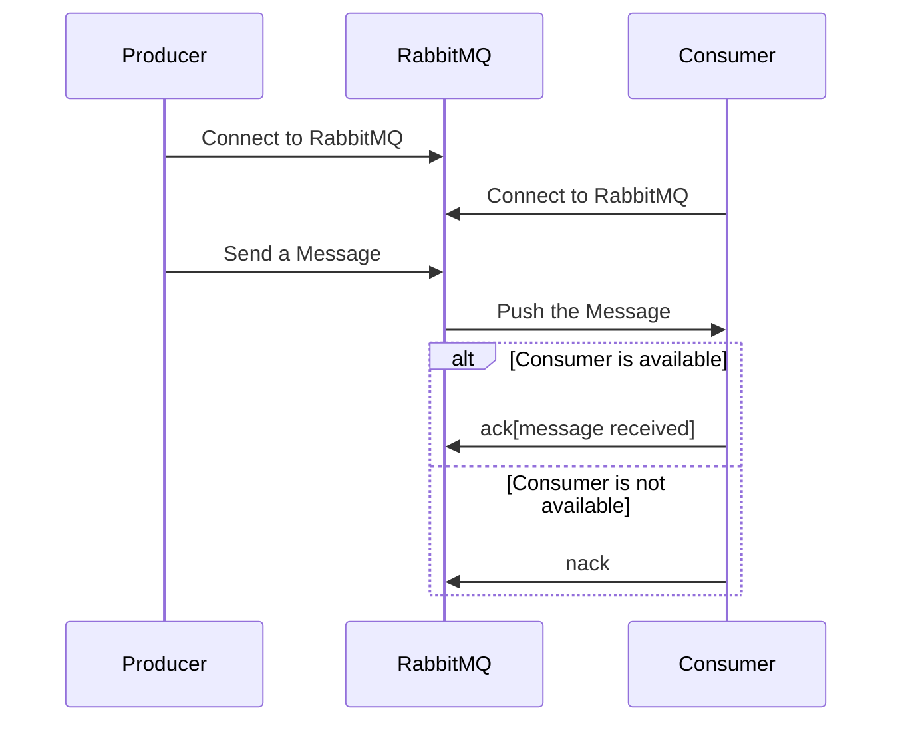
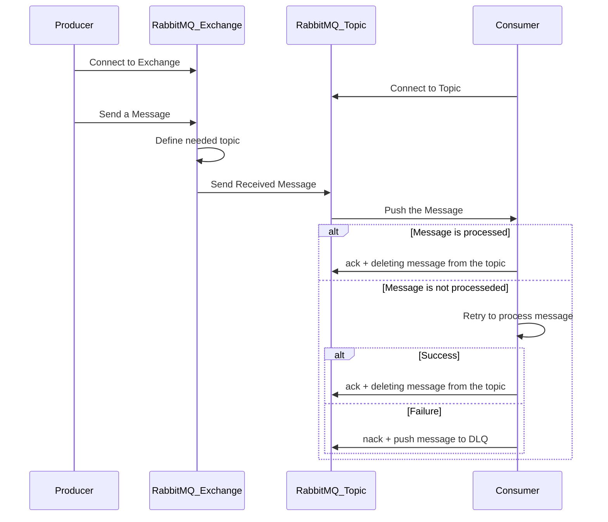
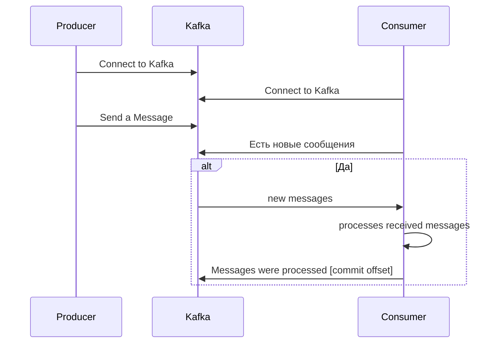

## 📔Брокеры · Базовые концепции

### 📑Для чего нужны брокеры сообщений?

Они являются посредниками в общении между микросервисами. Брокер принимает сообщения от одного сервиса, сохраняет их и передает другому сервису.

Брокеры позволяют отделить источник данных от того, кто непосредственно будет использовать эти самые данные. Помимо этого, сервисам больше не нужно самостоятельно отправлять сообщения в другие сервисы. Все это в совокупности, позволяет снизить нагрузку на сервисы и повысить масштабируемость всей системы в целом.

|                                        |                                                                                                                                                                                                                                                                                                                                                                                                                                                                                                                                                                                                                   |
| -------------------------------------- | ----------------------------------------------------------------------------------------------------------------------------------------------------------------------------------------------------------------------------------------------------------------------------------------------------------------------------------------------------------------------------------------------------------------------------------------------------------------------------------------------------------------------------------------------------------------------------------------------------------------- |
| **Компоненты брокера сообщений**       | 🧩`producer` - издатель сообщений, обычно источник данных<br><br>🧩`consumer` - потребитель/подписчик (зависит от модели внутри брокера) сообщений                                                                                                                                                                                                                                                                                                                                                                                                                                                                |
| **Основные задачи брокера сообщений**  | 🟡**Обработка сообщений.** Брокер валидирует формат и содержание сообщений отправителей перед передачей нужным получателям.<br><br>🟡**Хранение сообщений.** Если получатель временно недоступен или занят, брокер сохранит сообщение, чтобы оно могло быть доставлено позже.<br><br>🟡**Маршрутизация.** Брокер определяет кому и что должно быть передано.<br><br>🟡**Гарантированная доставка.** Если получатель временно недоступен, брокер будет продолжать попытки доставки — вплоть до успешного её завершения.<br><br>🟡**Повышение производительности системы** за счет асинхронной обработки сообщений. |
| **Плюсы брокеров**                     | - асинхронная обработка<br>- гарантия доставки<br>- гибкость (можно докинуть consumer)<br>- устойчивость к сбоям                                                                                                                                                                                                                                                                                                                                                                                                                                                                                                  |
| **Минусы брокеров**                    | - усложнение системы, т.к. появляется дополнительный компонент системы<br>- тяжело искать причины ошибок из-за асинхронной работы и распределенного характера системы<br>- непросто внедрить                                                                                                                                                                                                                                                                                                                                                                                                                      |
| **Когда полезно использовать брокеры** | - микросервисы, мобильные приложения<br>- уведомления, события<br>- background jobs<br>- saga, outbox, inbox                                                                                                                                                                                                                                                                                                                                                                                                                                                                                                      |
### 📑В чём разница между RabbitMQ и Kafka?

|                                   | 🐇RabbitMQ                                                                                                                           | ![[Pasted image 20250601161411.png\|15]]Kafka                                   |
| --------------------------------- | ------------------------------------------------------------------------------------------------------------------------------------ | ------------------------------------------------------------------------------- |
| **назначение**                    | обмен сообщениями через очереди                                                                                                      | потоковая обработка данных (event streaming)                                    |
| **модель внутри**                 | очереди(message queue)                                                                                                               | лог событий(append-only log)                                                    |
| **тип подписки**                  | Push: брокер отправляет сообщение потребителю                                                                                        | Pull: потребитель сам читает из лога                                            |
| **повторная обработка сообщения** | неудобно, т.к. сообщение удаляется после ack                                                                                         | удобно, т.к. сообщения хранятся — читаешь сколько хочешь                        |
| **где хранятся сообщения**        | в памяти + диск (до ack или ttl)                                                                                                     | на диске (в логах, часто на много дней)                                         |
| **тип очереди**                   | FIFO (очередь/экземпляр — 1 консюмер)                                                                                                | топики с партициями (много консюмеров параллельно)                              |
| **задержка (latency)**            | ниже                                                                                                                                 | выше                                                                            |
| **пропускная способность**        | ниже                                                                                                                                 | очень высокая (десятки/сотни МБ в секунду)                                      |
| **масштабирование**               | горизонтально сложно ([[🐇RabbitMQ#**Почему RabbitMQ сложно горизонтально масштабировать?**\|читай дополнительно]])                  | легко масштабируется через партиции                                             |
#### 〽️Сравнение эффективности работы RabbitMQ и Kafka в различных сценария

| Сценарий                          | **🐇RabbitMQ**                     | **![[Pasted image 20250601161411.png\|15]]Kafka** |
| --------------------------------- | ---------------------------------- | ------------------------------------------------- |
| RPC (запрос-ответ)                | ✅ Удобно                           | ⛔ Не предназначен                                 |
| Механизм повторных попыток        | ✅ Есть встроенные (DLQ, TTL и т..) | ❌ Нужно реализовывать вручную                     |
| Сохранение истории событий        | ❌ Не для этого                     | ✅ Kafka — именно для этого                        |
| Событийная архитектура            | ✅ Подходит                         | ✅ Отлично подходит                                |
| Реализация Outbox Pattern         | 🔧 Сложнее                         | ✅ Идеально подходит                               |
| Высоконагруженные пайплайны (ETL) | ⛔ Не подходит                      | ✅ Супер подходит                                  |
### 📑Когда выбрать Kafka, а когда RabbitMQ?

|               | 🐇RabbitMQ                                                                                                                           | ![[Pasted image 20250601161411.png\|15]]Kafka                                   |
| ------------- | ------------------------------------------------------------------------------------------------------------------------------------ | ------------------------------------------------------------------------------- |
| выбираем если | - просты очереди задач, подтверждение, DLQ<br>- нужно просто отправить задачу и ждать ack<br>- нужна работы с временными сообщениями | - нужна доставка событий с историей<br>- высоконагруженные логи, аналитика, ETL |
### 📑Что такое Dead Letter Queue?

|                 | [[Dead Letter Queue (DLQ)\|💀Dead Letter Queue или DLQ]]                                                                                                                                                                                                                                                           |
| --------------- | ------------------------------------------------------------------------------------------------------------------------------------------------------------------------------------------------------------------------------------------------------------------------------------------------------------------ |
| определение     | очередь "мёртвых" сообщений** — используется для обработки **неудачно доставленных или ошибочных сообщений**. Общая концепция, поддержка которой есть в разных брокерах. Единственное, в Kafka ее нужно реализовать вручную через отдельный topic. Остальные брокеры из коробки имеют механизмы для ее реализации  |
| назначение      | - изолировать плохие сообщения<br>- предотвратить блокировку очереди из-за одного "плохого" сообщения<br>- можно вести учет фейлов                                                                                                                                                                                 |
| алгоритм работы | 1) consumer получает сообщение.<br>2) происходит ошибка (например, не удалось десериализовать данные из сообщения или сохранить в БД).<br>3) в зависимости от политики:<br>    3.1) делаем **повторную попытку обработки (retry)**.<br>    3.2) если **все попытки исчерпаны** — сообщение отправляется в **DLQ**. |
| дополнительно   | -  DLQ — это просто **обычная очередь**, куда скидываются плохие сообщения<br>- реализация в RabbitMQ работает с TTL и MAX RETRIES через `x-dead-letter-exchange` и `x-dead-letter-routing-key`                                                                                                                    |

## 📔Архитектура RabbitMQ

### 📑Что такое Push модель при взаимодействии с брокером сообщений?

Способ взаимодействия, при котором брокер сам отправляет consumer сообщения, как только они, сообщения, приходят. Наиболее популярным брокером, реализующим такой тип взаимодействия, является RabbitMQ.
#### 🔠Алгоритм работы по Push модели



#### ❌Минусы Push модели

- **переполнение очереди**, если брокер слишком быстро отправляет сообщения, а consumer не успевает их обрабатывать
- для ограничения количества сообщений в полете, нужно выставлять prefetch (см. пример для MassTransit)

```csharp
// Пример в MassTransit (RabbitMQ) — ограничение prefetch:
cfg.ReceiveEndpoint("orders", ep =>
{
    ep.PrefetchCount = 16; // ограничение — 16 сообщений максимум за раз
});
```

#### 〽️Когда использовать Push модель

🔸если нужна низкая задержка и реакция в реальном времени
🔸когда сообщений немного
🔸если не нужна сложная обработка сообщений, например, email, уведомления
### 📑Что такое exchange?

**Exchange** - своего рода маршрутизатор, который определяет в какую именно очередь нужно закинуть полученное сообщение.
![[Pasted image 20250601200848.png|rabbitmq-work|600]]

>*В RabbitMQ exchanges, connections и topics при создании могут быть сконфигурированы с такими параметрами, как `durable` (надёжный), `temporary` (временный) и `auto-delete` (автоматическое удаление). Durable exchanges переживают перезапуск сервера и существуют до тех пор, пока не будут явно удалены. Temporary exchanges существуют до остановки RabbitMQ. Auto-Delet Exchanges удаляются, как только последний привязанный к ним объект отвязывается*
### 📑Какие виды exchange существуют?

- **часто используемые:**
	- direct: сообщение помещается в очередь(и) с ключом привязки, который точно соответствует ключу маршрутизации сообщения
	- topic: рассылка идет по шаблону в routing key, что позволяет делать маршрутизацию по маске ("user.*" или "*.error")
	- fanout: рассылка сообщений идет **во все очереди**, привязанные к этому exchange, **игнорируя routing key**
	- headers: рассылка сообщений осуществляется исходя их заголовков сообщений, а не routing key
- *редко используемые:*
	- *default: рассылка сообщений идет в очередь, имя которой полностью соответствует routing key (каждая очередь автоматически привязывается к стандартному exchange с ключом маршрутизации, который совпадает с именем очереди)*
	- *dead letter: сюда будут закидываться сообщения, для которых не нашлось очереди, но только в том, случае если Dead Letter Exchange настроена*

### 📑Что такое очередь?

Очередь - это место, где хранятся сообщения, пока их не прочитает consumer.
#### 🔠Алгоритм работы очереди в RabbitMQ



### 📑Как работает маршрутизация сообщений в RabbitMQ?

Для маршрутизации сообщений в RabbitMQ используется такой элемент сообщения, как routing key - строка (часть метаданных сообщения), указываемая при публикации сообщения и указывающая в какую очередь нужно будет закинуть сообщение:

```csharp
channel.BasicPublish(
    exchange: "my-exchange",
    routingKey: "order.created",
    basicProperties: null,
    body: messageBytes
);
```

Routing key **не является частью тела (body)** сообщения, но он входит в **метаданные**:

```plaintext
Message
├── Properties
├── Headers
├── Routing key (в момент публикации)
└── Body
```

RabbitMQ "не вшивает" `routingKey` в сообщение — он используется только **для маршрутизации**. Consumer его не получает, **если только явно не передать его в headers**, или не получить из `BasicDeliverEventArgs.RoutingKey`.
#### 📎 Как работает маршрутизация в зависимости от типа exchange:

- В **direct** exchange — `routingKey` должен **точно совпадать** с `bindingKey`.
- В **topic** exchange — `routingKey` проверяется по **шаблону**.
- В **fanout** — `routingKey` игнорируется вообще.
- В **headers** — используется не `routingKey`, а поля в `headers`.
#### 📌 Дополнительно

- `routingKey` нужен **только на этапе доставки сообщения в очередь**, потребителю он **по умолчанию не нужен**.
- в большинстве RabbitMQ клиентов можно **получить `routingKey` на стороне потребителя** — если надо логировать, фильтровать и т.д.
- чтобы **динамически маршрутизировать сообщения**, часто используются `topic exchange` и шаблоны в `routingKey`.
## 📔Архитектура Kafka

### 📑Что такое Pull модель при взаимодействии с брокером сообщений?

Способ взаимодействия, при котором consumer сам запрашивает у брокера сообщения, как только они, сообщения, приходят. Наиболее популярным брокером, реализующим такой тип взаимодействия, является Kafka.
#### 🔠Алгоритм работы по Pull модели



|                    |                                                                                                                                                                                                       |
| ------------------ | ----------------------------------------------------------------------------------------------------------------------------------------------------------------------------------------------------- |
| плюсы модели       | - **полный контроль над скоростью** получения данных (backpressure)<br>- клиент может самостоятельно устанавливать лимит на количество обрабатываемых сообщений или обрабатывать их порциями          |
| минусы модели      | - сложнее реализовать чем push модель<br>- нужно следить за смещениями в очереди (**offset**), чтобы понимать, что прочитано, а что еще нет<br>- возможна задержка, если polling настроен неправильно |
| когда использовать | - нужен контроль процесса обработки, например, в аналитике<br>- нужно хранить сообщения в брокере, пока клиент их не запросит<br>- нужен **точный контроль над повторной доставкой** и offset         |
### 📑Что такое topic?

Topic - канал или категория, в которую публикуются сообщения. Внутри topic состоит из одной или нескольких **партиций** - физический фрагмент данных в topic, где хранятся сообщения в упорядоченном виде.
### 📑Что такое partition? Для чего нужна?

**Партиция** - физический фрагмент данных в topic, где хранятся сообщения в упорядоченном виде.
#### 📦 Как работают партиции?

- **каждое сообщение** попадает в **одну** конкретную партицию
- внутри партиции Kafka **гарантирует порядок** сообщений
- каждое сообщение получает **уникальный offset** внутри партиции (например, `0`, `1`, `2`...)

#### 🧠 Как выбирается партиция?

Kafka использует **ключ сообщения (key)** и **алгоритм хеширования**:

```csharp
producer.Produce("orders", new Message<string, string>
{
    Key = "order-123", // ← влияет на выбор partition
    Value = "{ id: 123, userId: 45 }"
});
```

- если **key указан** — Kafka хеширует его и направляет в соответствующую партицию
- если **key не указан** — Kafka выбирает партицию **случайным образом** (round-robin)

> Благодаря `key` **все события с одинаковым ключом попадут в одну и ту же партицию**, что полезно, если важен порядок, например, все операции по одному заказу
#### 🎯 Партиции нужны для

- **обеспечения параллелизма**: партиции позволяют читать данные параллельно нескольким потребителям
- **масштабирования**: Kafka может обрабатывать миллионы сообщений в секунду
- **гарантии порядка сообщений**: внутри одной партиции Kafka гарантирует порядок сообщений
### 📑Что такое consumer group?

**Consumer group** - логическое объединение потребителей, которые читают данные из одного топика. При этом сообщение из topic обработает только один участник consumer group. Все участники группы делят между собой партиции, чтобы **не дублировать** обработку.
#### ➗Как партиции раскидываются внутри consumer group

Kafka **автоматически распределяет партиции** между потребителями внутри группы:
- если потребителей **меньше**, чем партиций — некоторые будут читать по несколько партиций
- если потребителей **больше**, чем партиций — "лишние" потребители будут **простаивать**

#### 🔁 Rebalancing (перебалансировка)

Когда в группу входит или выходит consumer, Kafka **перераспределяет** партиции между всеми участниками. Это называется **rebalancing**.

> ***Во время ребалансировки группа временно не обрабатывает сообщения.***

#### 🗂️ Offset и consumer group

Каждая группа **отслеживает свой собственный offset**:

- offset — это "где остановились" при чтении партиции.
- хранится в Kafka (в отдельном topic `__consumer_offsets`).

Благодаря этому:

- каждый consumer group может читать **один и тот же topic**, но **независимо** от других групп
- можно читать заново, переигрывать обработку, делать retry и т.д.

## 📔Гарантии доставки

### 📑Какие бывают гарантии доставки сообщения?

|                   | At most once                                                                                                                         | At least once                                                                                                                                                                                                                                                                                                                    | Exactly once                                                                                                                                                                                                                                                                                                                                                           |
| ----------------- | ------------------------------------------------------------------------------------------------------------------------------------ | -------------------------------------------------------------------------------------------------------------------------------------------------------------------------------------------------------------------------------------------------------------------------------------------------------------------------------- | ---------------------------------------------------------------------------------------------------------------------------------------------------------------------------------------------------------------------------------------------------------------------------------------------------------------------------------------------------------------------- |
| значение          | не более одного раза, возможна потеря сообщения                                                                                      | минимум один раз, могут быть дубликаты                                                                                                                                                                                                                                                                                           | ровно один раз, нет ни потерь, ни дубликатов                                                                                                                                                                                                                                                                                                                           |
| пояснение         | - сообщение может быть доставлено или потеряно<br>- получатель не подтверждает доставку<br>- простая и быстрая модель, но ненадёжная | - сообщение доставляется минимум один раз, но возможно повторно<br>- возможны дубликаты, если потребитель неуспешно обработал сообщение, и брокер отправил его повторно<br>**Как реализуется:**<br>- потребитель **подтверждает (ack)** успешную обработку <br>- если подтверждения нет — брокер **повторно отправит** сообщение | - сообщение гарантированно обрабатывается один раз<br>- нет потерь, нет дубликатов<br>- самая сложная в реализации, требует идемпотентности, транзакций или согласованности offset-ов и записи<br>**В Kafka поддерживается Exactly once semantics (EOS) через:**<br>- идемпотентный продюсер<br>- транзакционный продюсер<br>- управление offset-ами внутри транзакции |
| пример реализации | UDP, ненадёжная сеть, логика, где потеря не критична, например, **логирование, аналитика**<br>📌**Если не дошло - ну и ладно**       | RabbitMQ с manual ACK, Kafka по offset, например, **отправка email-уведомлений, система заказов**<br>📌**Лучше дважды, чем ни разу**                                                                                                                                                                                             | Kafka, например, **финансовые транзакции, система заказов**<br>📌**Ровно один раз — любой ценой**                                                                                                                                                                                                                                                                      |
>Если система поддерживает идемпотентность, то даже при at least once можно достичь поведения "как будто exactly once"
### 📑Как обеспечить гарантированную доставку сообщений?

Реализовать либо At least once, либо Exactly once.