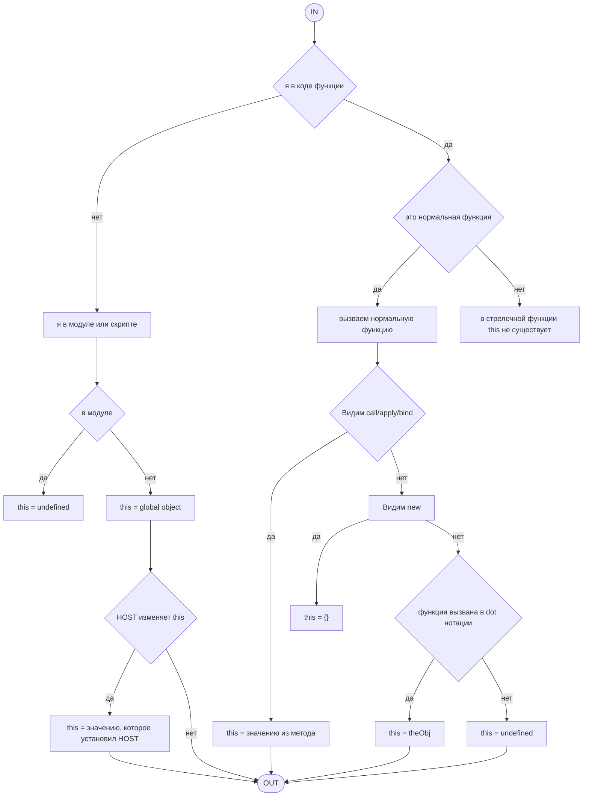

- [[#💡Что такое JavaScript]]
- [[#📚var vs let vs const]]
- [[#Как предотвратить изменение объекта]]
- [[#Как клонировать объект]]
- [[#Типы данных в JS]]
- [[#Function Expression vs Function Declaration]]
- [[#this в JS]]
- [[#Различия между стрелочной и обычной функцией]]
- [[#Сравнение в JS]]
- [[#Что такое замыкание]]
- [[#Делегирование событий]]
- [[#Атрибуты async и defer]]
- [[#Event Loop, rAF, rIC]]
- [[#Прототипы и прототипное наследование]]
- [[#debounce, throttle, curry]]

# 💡Что такое JavaScript

- **переменные могут быть любого типа**
- **тип** переменной определяется **на этапе выполнения** (runtime)
- **тип** переменной **может изменяться в зависимости от** присваиваемого ей **значения** (см. пример ниже)

```js
let myVariable = 10; // myVariable is initially a number
console.log(typeof myVariable); // Output: "number"

myVariable = "Hello"; // myVariable is now a string
console.log(typeof myVariable); // Output: "string"

myVariable = true; // myVariable is now a boolean
console.log(typeof myVariable); // Output: "boolean"
```

- **JavaScript слабо типизированный** потому что позволяет выполнять автоматическое приведение типов, т.е. **значения разных типов** могут быть использованы **вместе** и язык **автоматически приводит их к подходящему типу** *(читай [[🤙Правила приведения типов|Правила приведения типов]])*

```js
console.log(4 + '7'); // Output: '47'
console.log(4 * '7'); // Output: 28
console.log(2 + true); // Output: 3
console.log(false - 3); // Output: -3
```

- JavaScript работает в одном потоке, т.е. в каждый момент времени выполняется только 1 инструкция; однако благодаря механизму **событийного цикла (Event Loop)** и асинхронным конструкциям (`callback, Promise, async\await`) JavaScript может эффективно управлять задачами ввода-вывода и др. асинхронными операциями

- JavaScript может быть встроен в **различные среды выполнения**, и его **поведение и доступные АР1 зависят от окружения, в котором он работает**. Примеры таких окружений включают браузеры, серверы на основе Node.js, мобильные приложения на React Native, десктопные приложения на Еlесtrоп и устройства Интернета вещей (IоТ)

- JavaScript поддерживает следующие парадигмы программирования:

a. **императивная**: фокус на выполнении задачи с использованием последовательных инструкций

```js
let numbers = [1, 2, 3];

let sum = 0;
for (let i = 0; i < numbers.length; i++) {
	sum += numbers[i];
}

console.log('Sum = ', sum);
```

b. **ООП**

```js
class ArraySummer {
  constructor(array) {
    this.array = array;
  }

  // getSum - функция высшего порядка, т.к. принимает в себя callback
  getSum() {
    return this.array.reduce((acc, val) => acc + val, 0);
  }

  calculatESum(){
	  let sum = 0;
	  for (let i = 0; i < this.array.length; i++) {
		  sum += this.array[i];
	  }
	  return sum;
  }
}

// Пример использования:
const summer = new ArraySummer([1, 2, 3, 4, 5]);
console.log(summer.getSum()); // 15
```

c. **функциональная**: ключевой блок - функция. JavaScript поддерживает следующие функциональные концепции: [[Функция высшего порядка|функция высшего порядка]], [[Неизменяемость данных (иммутабельность)|неизменяемость данных]], [[Чистая функция|чистая функция]]

d. **событийно-ориентированная**:

```js
document.getElementById('myButton').addEventListener('click',
	function(){
		alert('Button clicked');
});
```

e. **асинхронное программирование**: когда результат возвращается не сразу, а через некоторое время. В JavaScrip реализуется через callback, Promise, async\await

```js
async function fetchData(){
	try{
		const response = await fetch('<https://api.example.com/data>');
		const data = await response.json(); console.log(data);
	} catch (error) {
	console.erro('Error fetching data:', error); 
	} 
}
fetchData(); 
```


# 📚var vs let vs const

let и const были введены в EcmaScript 2015 (ES6) и предоставляют улучшенные возможности по сравнению с var.

Хотя иногда говорят, что let и const пришли на замену var, правильнее сказать, что они пришли на замену var в большинстве случаев использования JavaScript в современных кодов базах. Однако var все еще важен для производительности в некоторых специфических сценариях.

При использовании let и const появляется дополнительная проверка на то, не пытаемся ли мы обратиться к переменной пока она не была объявлена. А с var такого нет, т.е. отсутствует так называемая "мертвая зона", поэтому использование var некоторый выигрыш в производительности. Однако, у var есть нежелательны побочные эффекты, из-за которых он реже используется в современной кодовой базе. Также код с var тяжелее отлаживать.

## Ключевые различия let, const и var

| Характеристика                                                   | let и const                                                                                                                                                                                                                                        | var                                                                                                                                   |
| ---------------------------------------------------------------- | -------------------------------------------------------------------------------------------------------------------------------------------------------------------------------------------------------------------------------------------------- | ------------------------------------------------------------------------------------------------------------------------------------- |
| область видимости (*см. пример 1 кода после таблицы*)            | **блочная**, т.е. переменная объявленная через let или const доступна **только внутри блока**, в котором она объявлена                                                                                                                             | **функциональная** (иначе глобальная), т.е. переменная объявленная через var доступна в **пределах функции**, в которой она объявлена |
| всплытие (hoisting)                                              | поднимаются и **попадают во временную мертвую зону (TDZ)** до тех пор, пока не будут инициализированы, поэтому если к ним обратиться вылетит ошибка, что эти переменные еще не инициализированы                                                    | поднимаются и **инициализируются значением undefined**, поэтому к ним можно всегда обратиться                                         |
| переопределение и объявление (*см. пример 2 кода после таблицы*) | **let**: нельзя повторно объявить переменную с таким же названием, а сама переменная **может быть не** инициализирована<br>**const**: нельзя повторно объявить переменную с таким же названием, а сама переменная **должна быть** инициализирована | **var**: можно объявить повторно переменную в одной и той же области видимости                                                        |
| изменение значения (*см. пример 3 кода после таблицы*)           | **let**: можно менять значение после объявления<br>**const**: нельзя менять значение после объявления (хотя свойства объекта, объявленные через const, могут изменяться)                                                                           | **var**: можно менять значение после объявления                                                                                       |

```js
// Пример 1
function scopeExample(){
	if(true){
		var functionScoped = "var functionScoped";
		let blockScopedLet = "let blockScopedLet";
		const blockScopedConst = "const blockScopedConst";
	}

	console.log(functionScoped); // var
	console.log(blockScopedLet); // Uncaught ReferenceError: blockScopedLet is not defined
	console.log(blockScopedConst); // Uncaught ReferenceError: blockScopedConst is not defined, а по факту сюда даже не дойдет
}

scopeExample();

// Пример 2
var a = 1;
var a = 2; //ok

let b = 1;
let b = 2; //error

const v = 3;
const v = 4; //error

// Пример 3
var a = 1;
a = 9;

let b = 2;
b = 4;

const c = 4;
// c = 3; // error

const objh = {meaningOfLife: 43};
objh.meaningOfLife = 76;

// Пример практической задачи
for (var i = 0; i < 10; i++) {
  setTimeout(j => console.log(j), 1000, i);
}

for (let i = 0; i < 10; i++) {
  setTimeout(() => console.log(i), 1000);
}

for (var j = 0; j < 10; j++) {
  (function (k) {
    setTimeout(() => console.log(k), 1000);
  })(j);
}
```

# Как предотвратить изменение объекта

Дескрипторы свойств у объектов:
- **enumerable** - отвечает за то, будет ли свойство перечисляться в циклах (for..in, Object.keys)
- **writable** - отвечает за то, можно ли изменять свойство
- **configurable** - отвечает за то, можно ли изменять другие дескрипторы свойства, удалять свойство, изменять тип свойства

```js
let obj = {};
Object.defineProperty(obj, 'name', {
	value: 'John',
	writable: false,
	enumerable: true,
	configurable: false
});

console.log(obj.name); //John
obj.name = 'Jane'; // error in strict mode
console.log(obj.name); //John
console.log(Object.keys(obj)); // ['name']
```

Способы изменения объекта  (от самого нестрогого к самому строгому):

- `Object.preventExtensions()` - предотвращает добавление новых свойств в объект; тем не менее, существующие свойства можно изменять или удалять 

```js
let obj = {name: 'John'};
Object.preventExtensions(obj);

obj.age = 30;// in sloppy mode - nothing; in strict mode - error
console.log(obj.age); // undefined

delete obj.name;
console.log(obj.name); // undefined
```

- `Object.seal()` - не позволяет добавлять новые свойства или удалять существующие, но позволяет изменять существующие свойства, если они не являются не перезаписываемыми (`writable: false`)

```js
let obj = {name: 'John'};
Object.seal(obj);

obj.age = 30;// in sloppy mode - nothing; in strict mode - error
console.log(obj.age); // undefined

delete obj.name; // in sloppy mode - nothing; in strict mode - error
console.log(obj.name); // John

obj.name = 'Jane';
console.log(obj.name); // Jane
```

- `Object.freeze()` - полностью "замораживает" объект; нельзя добавлять, удалять или изменять свойства объекта

```js
let obj = {name: 'John'};
Object.freeze(obj);

obj.age = 30;// in sloppy mode - nothing; in strict mode - error
console.log(obj.age); // undefined

delete obj.name; // in sloppy mode - nothing; in strict mode - error
console.log(obj.name); // John

obj.name = 'Jane';// in sloppy mode - nothing; in strict mode - error
console.log(obj.name); // John
```


![[Pasted image 20250612121947.png]]
# Как клонировать объект

Виды копий объектов:

- **поверхностная (shallow)**: создает новый объект, но копирует только ссылки на вложенные объекты, а не их содержимое; так, если изменить свойство в первом объекте, изменение отразится и на втором. Способы создания:
  - `Object.assign({}, objectToCopy)`
  - спред-оператор `(...)`

![[Pasted image 20250612122227.png]]

- **глубокая (deep)**: создает новый объект и рекурсивно копирует все уровни вложенных объектов, создавая независимые копии. Способы создания:
  - `JSON.parse(JSON,stringify())`
  - `structuredClone()`
  - `_cloneDeep` из библиотеки Lodash
  - своя рекурсивная функция

>*JSON.parse() - лучше не использовать, т.к. это тяжелая операция из-за того, что сначала переводим объект в json, а потом еще этот json парсим*
# Типы данных в JS

### **Примитивные: неизменяемы**, т.е. операции над ними возвращают новые значения и не изменяют исходные, и **сравниваются по значению**

**number:** числовой тип, включающий как целые, так и с плавающей точкой (в JS все числа имеют тип number)

![[Pasted image 20250612123009.png]]

- **string:** символ или последовательность символов; строки могут быть заключены в одинарные, двойные или обратные кавычки
  
![[Pasted image 20250612123054.png]]

- **boolean:** логический тип, принимающий true либо false значение
  
![[Pasted image 20250612123136.png]]

>*К boolean в JS можно привести любое выражение*

- **null:** специальное значение, которое представляет собой "ничто" или "пустое значение"
	  
![[Pasted image 20250612123315.png]]
	
- **undefined:** значение по умолчанию для необъявленных переменных или переменных, которым не присвоено значение
	  
![[Pasted image 20250612123349.png]]
	
- **symbol:** уникальный и неизменяемый тип данных, используемый в основном как ключи для свойств объектов
	  
![[Pasted image 20250612123414.png]]
	  
	  
- **bigint:** тип данных для представления целых чисел произвольной точности, которые могут быть больше, чем максимальное число, которое можно безопасно представлять с помощью number
	  
![[Pasted image 20250612123444.png]]
	
### **Объекты**: изменяемы, т.к. свойства объектов можно изменять, и сравниваются объекты друг с другом по ссылке

- **Object:** базовая структура данных для создания объектов; объекты могут быть созданы при помощи литералов или через конструктор Object

![[Pasted image 20250612123547.png]]

- **Array**: упорядоченная коллекция значений, доступ к которым осуществляется по индексу; в JS массивы могут содержать значения любого типа

![[Pasted image 20250612123615.png]]

- **Function**: объекты, которые могут быть вызваны; функции являются первоклассными объектами, т.е. их можно передавать как аргументы, возвращать из других функций и присваивать переменным
![[Pasted image 20250612123734.png]]

- **Date**: объект для работы с датами и временем

![[Pasted image 20250612123758.png]]

- **RegExp**: объект для работы с регулярками

![[Pasted image 20250612123813.png]]

- **Map**: коллекция пар ключ-значение, где ключи могут быть любого типа

![[Pasted image 20250612123842.png]]

- **Set**: коллекция уникальных значений, которая за О(1) возвращает информацию о том, есть ли значение или нет

![[Pasted image 20250612123904.png]]
#### 🗑️Garbaga Collector

Работает автоматически, нет норм возможности запустить самостоятельно (за исключением костылей).

**Алгоритм работы** - Mark and Sweep.

1. **Разметка (Marking)** - GC проходит по всем объектам; если к ним есть доступ от корневых объектов (например, глобальные переменные, текущий стек вызовов), тогда они помечаются как "достижимые"
2. **Удаление (Sweep)** - GC проходит по памяти и удаляет все объекты, которые не были помечены как "достижимые"

![[Pasted image 20250612124108.png]]

![[Pasted image 20250612124139.png]]

![[Pasted image 20250612124149.png]]
# Function Expression vs Function Declaration


| Характеристика          | Function Declaration                                                                                                                                 | Function Expression                                                                                                                                      |
| ----------------------- | ---------------------------------------------------------------------------------------------------------------------------------------------------- | -------------------------------------------------------------------------------------------------------------------------------------------------------- |
| определение             | **объявление функции (function declaration)** - способ определения функции с использованием ключевого слова function, за которым следует имя функции | **функциональное выражение (function expression)** - это способ определения функции в виде выражения. Функция может анонимной или именованной            |
| *пример*                | *function greet(){<br>    console.log('Hello');<br>}<br>greet();*                                                                                    | *const greet = function(){<br>    console.log('Hello');<br>}<br>greet();*                                                                                |
| **Хоистинг (Hoisting)** | **"всплывают" в начало своей области<br>видимости**. Это означает, что использовать функцию можно до её объявления                                   | **не всплываю**т, их нельзя вызвать до присвоения переменной; функции могут быть анонимными                                                              |
| пример                  | sayHello(); //'Hello';<br><br>function sayHello(){<br>    console.log('Hello');<br>}                                                                 | // sayHello(); //Ошибка: sayHello не является функцией<br><br>const sayHello = function(){<br>    console.log('Hello');<br>}<br><br>sayHello(); // Hello |
| **Именованные функции** | Именованные функции - объявления функций всегда именованные, что позволяет ссылаться на функцию по имени внутри ее тела (например, рекурсии)         |                                                                                                                                                          |
| *пример*                | *function factorail(n){<br>    if (n <= 1) return 1;<br>	return n * factorial(n-1);<br>}<br><br>console.log(factorial(5)); //120*                    | *const factorail = function fact(n){<br>    if (n <= 1) return 1;<br>	return n * factorial(n-1);<br>}<br><br>console.log(factorial(5)); //120*           |
# this в JS

**this** в JavaScript можно воспринимать как дополнительный параметр функции, который определяет контекст, в котором выполняется функция. this может принимать любое значение, включая объекты, строки, числа и даже null или undefined.

```js
function theKolobolSpoiler(){
	console.log(`${this} съела Колобка`);
}

theKolobolSpoiler.apply('Лиса');

// Лиса съела Колобка
```

### Как определить чему равен this



**Normal function** - это не стрелочная функция

**Bind** - создает новую функцию, к которой привязывает переданное в него значение this, также фиксирует переданные данные

```js
function greet (greeting, punctuation) {
	console.log(greeting + ', ' + this.name + punctuation);
}

const person = { name: 'Alice' };
const boundGreet = greet.bind(person);
boundGreet('Hello', '!'); // Hello, Alice!

const boundGreet2 = greet.bind (person, 'Hello');
boundGreet2('Hello', '!'); // Hello, AliceHello, потому что второй bind принимает вместо одного аргумента два, поэтому ! просто игнорится
```

**Call/apply** - вызывают функцию с переданным значением this и аргументами. Различие только в том, как принимаются аргументы (массив в случае с apply, аргументы через запятую в случае с call)

```js
function greet (greeting, punctuation) {
	console.log(greeting + ', ' + this.name + punctuation);
}

const person = { name: 'Alice' };
greet.call(person, 'Hello', '!'); // Hello, Alice!

function greet (greeting, punctuation) {
	console.log(greeting + ', ' + this.name + punctuation);
}

const person = { name: 'Alice' };
greet.apply(person, ['Hello', '!']); // Hello, Alice!
```

```js
const obj = {
    a: 1,
    say() {
        return function(){
            console.log(this.a)
        }
    }
};

obj.say()(); // undefined

// Способы вывести 1
// #1
const obj = {
    a: 1,
    say() {
        return () => {
            console.log(this.a);
        }
    }
};

obj.say()(); // 1


// #2
const obj = {
    a: 1,
    say() {
        const self = this;
        return function(){
            console.log(self.a);
        }
    }
};

obj.say()(); // 1

// #3
const obj = {
    a: 1,
    say() {
        return function(){
            console.log(this.a);
        }.bind(this);
    }
};

obj.say()(); // 1
```

### 🔍 Что здесь происходит:

1. **`obj.say()`** — это метод объекта `obj`. Он возвращает **функцию**, а не вызывает её.
    
2. Когда ты делаешь **`obj.say()()`**, ты вызываешь **возвращённую функцию без контекста**.
    

---

### 💡 А ключевой момент в том, **какое значение у `this` в возвращённой функции**:

- `function() { console.log(this.a) }` — **обычная (не стрелочная) функция**.
    
- Когда такая функция вызывается без явного контекста (`obj`, `call`, `bind`, и т.д.), **`this` будет `undefined` в strict mode**, или глобальным объектом (`window` в браузере) в non-strict.
# Различия между стрелочной и обычной функцией

| Характеристика                                | Обычная функция                                                                                                                                                                            | Стрелочная функция                                                                                                                                                                                    |
| --------------------------------------------- | ------------------------------------------------------------------------------------------------------------------------------------------------------------------------------------------ | ----------------------------------------------------------------------------------------------------------------------------------------------------------------------------------------------------- |
| **синтаксис**                                 | *function regularFunction(a, b)<br>{<br>   return a + b;<br>}*                                                                                                                             | *const arrowFunction = (a, b) => a + b;*                                                                                                                                                              |
| **контекст this**                             | - внутри функции this = undefined<br>- если функция создана при помощи new, this = {}<br>- можно изменять при помощи bin/call/apply                                                        | **не существует**; стрелочная функция берет **this** из родительского окружения **в момент объявления**                                                                                               |
| *пример*                                      | *const foo = function () {<br>	console.log(this);<br>}<br><br>foo(); // undefined<br>new foo(); // {}<br>foo.call("42"); // 42*                                                            | *const parentFunction = function () {<br>	return () => {<br>		console.log(this);<br>	};<br>};<br><br>let saved Function = parentFunction.call("parent This");<br><br>savedFunction(); // parentThis*  |
| **псевдомассив arguments**                    | имеет доступ к  псевдомассиву **arguments**, который содержит **все** переданные **аргументы**                                                                                             | **нет** такого ключевого слова                                                                                                                                                                        |
| *пример*                                      | *const functionWithUknownParamsNumber = function () {<br>	console.log(arguments);<br>};<br><br>functionWithUknownParamsNumber(1, "2", true, null);<br>// {0: 1, 1: '2', 2: true, 3: null}* | *const functionWithUknownParamsNumber = () => {<br>	console.log(arguments);<br>};<br><br>functionWithUknownParamsNumber(1, "2", true, null);<br>// Uncaught ReferenceError: arguments is not defined* |
| **создание экземпляра функции с помощью new** | **Можно** использовать с оператором new  для создания нового экземпляра                                                                                                                    | **Нельзя** использовать с оператором new для создания нового экземпляра                                                                                                                               |
| *пример*                                      | *function RegularFunction(){<br>    this.value = 42;<br>}<br><br>const instance = new RegularFunction();<br>console.log(instance.value); // 42*                                            | *const ArrowFucntion = () => {<br>    this.value = 42;<br>}<br><br>const instance = new ArrowFunction();<br>// ArrowFunction is not a constructor.*                                                   |
| **создание генератора**                       | можно использовать для создания функции-генератор                                                                                                                                          | нельзя создать генератор                                                                                                                                                                              |
| *пример*                                      | *function* generatorFunction(){<br>    yeild 1;<br>	yeild 2;<br>	yeild 3;<br>}<br><br>const instance = generatorFunction();<br>console.log(instance.next()); // { value: 1, done: false}*  | *const generatorArrowFucntion = \*() => {};<br>// ошибка синтаксиса*                                                                                                                                  |
| **параметры с одинаковыми именами**           | в нестрогом режиме допускаются параметры с одинаковыми именами                                                                                                                             | не получится использовать параметры с одинаковыми именами, независимо от режима                                                                                                                       |
| *пример*                                      | *function RegularFunction(a, a, a){<br>    console.log(a);<br>	console.log(a, a, a);<br>}<br><br>regularFunction(1, 2, 3);<br>// 3<br>// 3 3 3*                                            | *const arrowFucntion = (a, a) => {};<br>// ошибка синтаксиса*                                                                                                                                         |
# Сравнение в JS

- == (нестрогое равенство)

![[Pasted image 20250612204925.png]]

![[Pasted image 20250612204941.png]]

![[Pasted image 20250612205003.png]]

![[Pasted image 20250612205012.png]]

![[Pasted image 20250612205026.png]]

![[Pasted image 20250612205033.png]]

- === (строгое равенство)

пункт правил 1 такой же как и у нестрого сравнения

false во всех остальных случаях

![[Pasted image 20250612205140.png]]

- Object.is()

![[Pasted image 20250612205337.png]]

![[Pasted image 20250612205343.png]]

![[Pasted image 20250612205423.png]]

![[Pasted image 20250612205434.png]]
# Что такое замыкание

![[Pasted image 20250612205503.png]]

![[Pasted image 20250612205515.png]]

![[Pasted image 20250612205618.png]]

![[Pasted image 20250612205650.png]]

![[Pasted image 20250612205722.png]]

![[Pasted image 20250612205752.png]]

![[Pasted image 20250612205805.png]]

![[Pasted image 20250612205853.png]]

![[Pasted image 20250612205902.png]]
# Делегирование событий

![[Pasted image 20250612210244.png]]

![[Pasted image 20250612210254.png]]

![[Pasted image 20250612210339.png]]

![[Pasted image 20250612210431.png]]

![[Pasted image 20250612210537.png]]

![[Pasted image 20250612210602.png]]

![[Pasted image 20250612210627.png]]

![[Pasted image 20250612210632.png]]
# Атрибуты async и defer

![[Pasted image 20250612210735.png]]

Способы асинхронной загрузки скриптов:

- атрибут defer: не блокирует страницу
- атрибут async: не блокирует страницу

![[Pasted image 20250612210855.png]]

![[Pasted image 20250612211017.png]]

![[Pasted image 20250612211055.png]]

![[Pasted image 20250612211111.png]]
# Асинхронность в JS

![[Pasted image 20250612211125.png]]

![[Pasted image 20250612211140.png]]

Способы организации асинхронности в JS:

- callback (самый старый)

![[Pasted image 20250612211217.png]]

![[Pasted image 20250612211317.png]]

Ниже показана проблема Callback hell:

![[Pasted image 20250612211325.png]]

- Promise (у него есть 3 состояния)

**Promise** - объект, который содержит информацию о состоянии асинхронной операции и о результате её выполнения. У Promise может быть 3 состояния:

- Pending (изначально)
- Fulfilled (успех)
- Rejected (неуспех)

```js
const myPromise = new Promise((resolve, reject) => {
	resolve("Task completed");
});

myPromise
	.then(result => {
		console.log(result); // "Task completed"
	})
	.catch(error => {
		console.error(error);
	});
```

**Promise API**

- Promise.all() - принимает массив, возвращает промис, с выполненными промисами или ошибку, если один из промисов завершился ошибкой
- Promise.allSettled() - принимает массив, возвращает промис с результатами
- Promise.race() - принимает массив, возвращает результат первого промиса либо ошибку
- Promise.any() - принимает массив, возвращает результат первого выполненного промиса

- **async/await - синтаксический сахар над Promise**

```js
async function asyncFunction() {
	try {
		const result = await myPromise;
		console.log(result); // "Task completed"
	} catch (error) {
		console.error(error);
	}
}
asyncFunction();
```

# Event Loop, rAF, rIC

![[Pasted image 20250612212015.png]]

![[Pasted image 20250612212105.png]]

![[Pasted image 20250612212205.png]]

![[Pasted image 20250612212226.png]]

![[Pasted image 20250612212322.png]]

![[Pasted image 20250612212345.png]]

![[Pasted image 20250612212355.png]]
# Прототипы и прототипное наследование

![[Pasted image 20250612212648.png]]

![[Pasted image 20250612212709.png]]

![[Pasted image 20250612212734.png]]

![[Pasted image 20250612212806.png]]

![[Pasted image 20250612212815.png]]

![[Pasted image 20250612212823.png]]

![[Pasted image 20250612212835.png]]

![[Pasted image 20250612212841.png]]

Как получить прототип:

- Object.getPrototypeOf()

![[Pasted image 20250612212901.png]]

- __proto__

![[Pasted image 20250612213004.png]]

Способы установки прототипа:

- Object.setPrototypeOf()

![[Pasted image 20250612213036.png]]

- __proto__

![[Pasted image 20250612213103.png]]

- Object.create()

![[Pasted image 20250612213126.png]]

![[Pasted image 20250612213139.png]]

![[Pasted image 20250612213153.png]]

![[Pasted image 20250612213241.png]]

![[Pasted image 20250612213250.png]]

![[Pasted image 20250612213304.png]]

![[Pasted image 20250612213316.png]]

![[Pasted image 20250612213325.png]]

![[Pasted image 20250612213331.png]]
# debounce, throttle, curry

![[Pasted image 20250612213351.png]]

![[Pasted image 20250612213646.png]]

![[Pasted image 20250612213833.png]]
