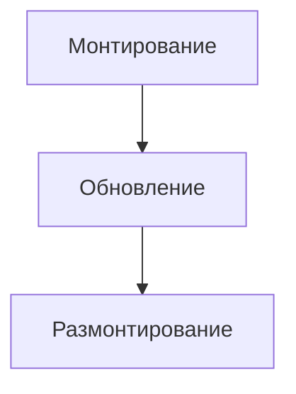

🔗[ReactJS фундаментальный курс от А до Я](#https://www.youtube.com/watch?v=GNrdg3PzpJQ)

> **React JS** - библиотека для создания пользовательских интерфейсов

- за отрисовку компонентов React в браузер отвечает библиотека React DOM
- "под капотом" React строит виртуальный DOM, который является облегченной копией обычного DOM (происходит процедура *согласования*)

>**Согласование (Reconciliation)** - процесс создания копии виртуального DOM И сравнения этого копии с реальным DOM (данная процедура осуществляется React CORE)

>**Отрисовка (render)** - стадия отрисовки найденных изменений на странице (осуществляет React DOM, React native)

>React хуки - это некоторые функции, которые предоставляет React; они могут быть использованы как в стандартных компонентах, так и при создании кастомных хуков. Вот наиболее распространенные хуки:
>- useState()
>- useEffect()
>- useRef()
>- useMemo()
>- useCallback()
>- useContext()

>Хуки могут быть использованы только на верхнем уровне вложенности; использование их в циклах, условиях и проч., невозможно

==**Useful React Tools for VS code:**==🔗[react tools](#https://www.telerik.com/blogs/top-5-vs-code-extensions-react-developers)

>Передача `props` идет всегда сверху вниз: от родителя к ребенку, поэтому невозможно из ребенка передать `props` в родителя. Чтобы обойти этот момент можно из родителя передать в ребенка некоторый `callback(props)`

`useMemo(callback, deps)` - callback должен возвращать результат каких-либо действий (напр. `{return [...posts].sort(...)}`); deps (dependecies) - `[selectedSort, posts]` - данный хук выполняет какое-либо действие и кэширует результаты (такая процедура называется "мемоизация"). `useMemo` перерисовывает элементы только в случае, если изменились зависимости (т.е. процедура мемоизации повторяется). Если массив зависимостей пуст, то `useMemo` отработает только один раз

**Жизненный цикл компонента React**



 - Монтирование (mount): монтирование компонента в DOM-дерево
 - Обновление (update): активная жизнь компонента, когда изменяется
 - Размонтирование (unmount): когда компонент больше не нужен мы его удаляем, т.е. размонтируем

>Для отслеживания стадий жизненного цикла компонента используется хук `useEffect(callback, deps)`

Хук вида `useEffect(fetchPosts(), [ ])` отработает лишь один раз - во время монтирования компонента

`useHistory()` - позволяет работать с динамическим роутингом

![[Pasted image 20240826173359.png]]

**Состояние** (или "state") в JavaScript, особенно в контексте веб-разработки и библиотек/фреймворков, таких как React, относится к данным, которые управляют тем, как компонент или приложение отображается и функционирует в течение своего жизненного цикла. Состояние может меняться в ответ на действия пользователей, сетевые запросы или другие события, и эти изменения могут приводить к обновлению интерфейса.

Вот несколько ключевых моментов о состоянии:

### 1. Динамическая информация

Состояние может содержать любую информацию, необходимую для отображения пользовательского интерфейса. Например:
- Текущий пользователь.
- Содержимое формы (значения полей ввода).
- Состояние загрузки данных (например, загрузка, успешное завершение, ошибка и т. д.).
- Списки элементов, отображаемых на странице.

### 2. Управление состоянием

В JavaScript состояние часто управляется при помощи следующих механизмов:

- **Локальное состояние** в компонентах (например, React использует `useState` для управления состоянием в функциональных компонентах).
- **Глобальное состояние** для приложения, которое может делиться данными между несколькими компонентами (например, контексты в React или библиотеки, такие как Redux, MobX и другие).

### 3. Изменение состояния

Когда состояние изменяется, компоненты, которые его используют, автоматически перерисовываются (в случае React и аналогичных библиотек). Это обновление UI происходит в результате изменения состояния. Процесс может выглядеть следующим образом:
1. Пользователь взаимодействует с приложением (например, нажимает кнопку).
2. В результате действия состояния изменяется.
3. Компоненты, зависящие от измененного состояния, перерисовываются с новыми данными.

### 4. Пример в React

```jsx
import React, { useState } from 'react';

const Counter = () => {
    const [count, setCount] = useState(0); // initialize state with 0

    return (
        <div>
            <p>The current count is: {count}</p>
            <button onClick={() => setCount(count + 1)}>Increment</button>
        </div>
    );
};
```

В этом примере `count` — это состояние, которое отслеживает текущее значение счётчика. Функция `setCount` обновляет значение `count`. Когда пользователь нажимает кнопку "Increment", состояние изменяется, и компонент автоматически перерисовывается с новым значением счётчика.

### 5. Состояние в контексте простых JS приложений

В простом JavaScript-приложении состояние может представлять собой обычные переменные, массивы или объекты. Например:

```javascript
let appState = {
    user: null,
    isLoading: false,
    items: []
};

// Изменение состояния
appState.isLoading = true;

// Отображение состояния
console.log(appState);
```

### Заключение

Состояние — это ключевая концепция в JavaScript и особенно важная в контексте разработки приложений. Оно позволяет динамически управлять информацией и реагировать на пользовательские действия, что делает приложения интерактивными и пользователями комфортными.